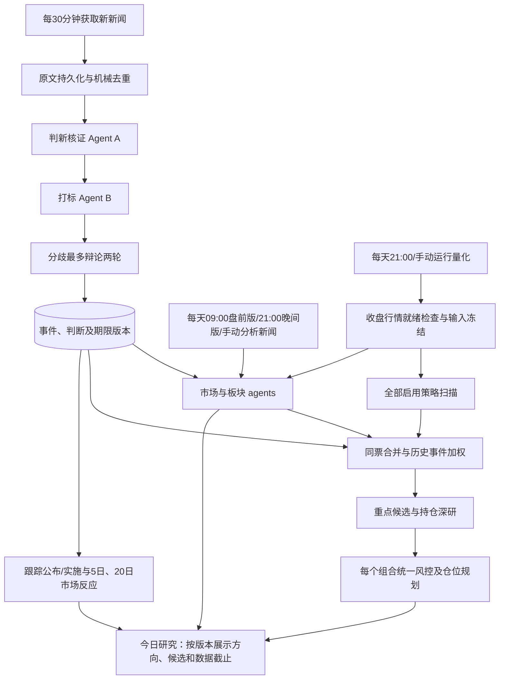

# 每日投研自动流程设计

> **状态**：待确认；已按“最佳整体设计”修订存储边界（2026-09-23）。原版 R3 PASS，不代表本次修订已重新评审；按 AGENTS.md 不自动重审。
> **关联文档**：[任务说明](README.md)｜[决策](decisions.md)｜[待验证项](issues.md)

## 一、背景与动机

| 维度 | 现状 | 问题 | 目标 |
|------|------|------|------|
| 新闻处理 | `AI/eventStudy/collectors/event_crawler.py` 按标题去重、写 Redis 草稿；`review/ai_prelabel.py` 单模型预填；`review_dao.approve_event` 人工落 PG | 同一事实换标题仍可能重复；日常需要逐条审核，没有判新/打标双 agent | 定期自动处理增量，有争议的少量事件进入人工队列 |
| 调度 | `AI/eventStudy/scheduler/app_scheduler.py` 默认 08:30 跑批，只挂独立事件 API；`backend/main.py` 明确不注册定时器 | 只开 Web 平台不等于已开启新闻定时任务；`daily_job.run_daily_job` 捕获步骤异常后可正常退出，旧调度器仍写完成标记 | 统一持久化阶段状态，可补跑，失败不能冒充完成 |
| 量化 | `QuantTaskSubmissionService.submit` 一次冻结一个策略版本和一个组合；`QuantExecutionService._run` 扫描后立即规划订单 | 对所有策略重复提交完整任务，会分别消耗同一个组合预算；没有“当日所有策略”聚合 | 所有启用策略先扫描，同票合并后一个组合只规划一次 |
| AI 融合 | `backend/workers/analysis_executor.py:_run_quant` 先量化后 AI，只合并报告；量化 `execution.py` 传 `risk_gate=None` | 勾选 AI + 仓位不会让 AI 的市场结论参与量化仓位；旧 CLI Position 还读取另一份文件组合 | 共享市场/事件快照，重点候选深研，平台仓位统一收口 |
| 数据时点 | `DataReadinessGate.resolve` 取四类数据最大日期的最小值；事件历史查询以 announced_at 过滤 | 可用昨日数据产出今日任务；post_event_5d 样本可能只含部分窗口，未来形成的统计可能进入历史预测 | 明确行情日、新闻截止、实际可用时间及下一交易日 |
| 使用入口 | `EventStudyPage` 默认打开 `PredictionTab`，`PredictionForm` 要求人填 `event_text`、`asset_ticker`、窗口并决定 `save`；结果只留在本次 mutation；旧预测窗口只有 `pre_event_5d/event_day/post_event_5d` | 每日新闻已由系统采集，用户却还要复制事件文本逐条提交；无法查看每版全部已知事件的预测与追踪 | “事件研究”改为按批次读取入库事件的预测工作台；每天09:00/21:00及手动新闻分析自动生成并保存当版事件预测，不再以人工录入为主路径 |

## 二、架构设计

主线分成持续新闻处理和每日研究两个节奏。新闻无需等待收盘；量化扫描和市场/板块研究可并行，最终汇合。首期属于研究与建议流程，保留现有成交确认链。

用户指定的固定时点：Asia/Shanghai 每天 09:00 盘前新闻/市场版、21:00 晚间新闻/市场版，全部启用量化策略每天 21:00 开始运行；页面分别提供新闻分析和量化运行的手动按钮。建议默认值，均可配置：新闻平时每 30 分钟持续采集（含周末），08:30–09:00 和 20:30–21:00 临近出报告时加密抓取及优先研判；交易日收盘后可从 15:30 提前检查/补齐行情，但不得提前自动运行量化策略；21:00 准入后如数据未就绪每 15 分钟重查，默认 22:00 为行情等待截止，不是策略计算截止；近 90 个自然日事件窗口；深研排名前 10 只、全部持仓与重大冲突候选。具体行情发布时间由数据源验收决定。加密频率和提前量经新闻源限速与模型耗时 POC 校准，不能未经验证承诺全部新闻在整点前完成。

“明天”统一解释为下一交易日；“未来一周/一个月”暂按从日报截止后起算的未来5/20个交易日定义，周五产出从下一开市日计入，报告列出实际起止日期。这是便于与交易和行情验证一致的工程口径，非自然周/月。09:00/21:00 新闻与市场研判每天发布，包括周末/休市日。21:00 量化准入每天检查；休市且无新收盘交易日时不重复全市场扫描，展示上次结果及行情日期，允许因新事件重算事件权重。21:00 新闻版与量化扫描可并行，新闻版不等待量化完成；候选/仓位区块标明所引用的最近有效量化版或“运行中”。只有行情、策略和策略持仓上下文哈希不变时复用扫描，否则按4.4使相关阶段失效重算。

### 2.1 数据模型设计

设计目标是职责清楚、历史可信且维护成本合理，不是表越少越好。本次推荐新增 `news`、`event_assessment` 两张业务表，同时复用任务、报告、信号与订单能力。两张表是比较后的选择，不是数量上限；不再把控制状态、模型响应、业务结论和向量版本塞成一张多态表。

| 备选 | 收益 | 代价与结论 |
|------|------|------------|
| 零新表，原文与事实版本放任务/报告 JSON | 可以复用现有持久化设施 | `report_version` 属于任务而非跨来源事件；task 删除会级联删报告，历史查询和向量检索需额外适配。技术可行，但本需求下维护负担较大，不推荐 |
| 原文、事件身份、事实判断分开；执行能力复用 | 独立唯一约束、清楚的生命周期和时点查询；新闻证据不随任务清理消失 | 需要两张业务表及迁移；对本次持续采集、反复研判和历史加权的目标最合适，推荐 |
| 原文、判断、目标标签、证据关系、向量、运行控制全面拆表 | 可独立索引和扩展每类实体 | 当前目标标签主要随事实版本整体读写，只有一个向量模型；全部拆开会增加联表与维护成本。出现独立查询、更新或性能需求时再拆对应实体 |

例如，同一政策有三家媒体报道，对应三份来源原文、一个规范事件；随后正式更正，需要保留旧判断和新判断。新闻、事件、研判版本有不同身份和生命周期，不能因为通用 JSON 能容纳它们就当作同一种数据。AI 每次发言和失败重试属于执行过程，继续使用现有任务与受保护产物。

首期采用模块化单体：自动流程涉及的平台任务与事件业务表位于同一物理 PostgreSQL 数据库，通过共享 Unit of Work 的同一个连接完成短事务。代码默认均可从 PG_* 配置连接，但平台 `LIVEPROFIT_DATABASE_URL` 与事件 `PG_CONNECTION_STRING` 可分别覆盖，不能据此认定实际部署已同库。启用前必须核验目标数据库身份；不同库时明确阻止启用并先制定配置/数据迁移，不自动切连接或迁移数据。首期不为未要求的跨库部署新建控制表或分布式事务协议。各模块迁移仍有独立归属，实施时取最新迁移 head。

| 逻辑对象 | 存储选择与必要性 |
|----------|------------------|
| news【新业务表】 | 一行一份来源原文版本；独立于采集/分析任务保存，可被多次研判、多事件引用；来源身份、原文版本和首次获得时间由持久层约束 |
| event_assessment【新业务表】 | 一行一个事件事实的正式判断版本；保存标签、来源证据、正式更正与撤回，提供跨任务的事实版本和时点索引；不保存运行控制行或逐轮模型发言 |
| AI 响应、辩论、执行失败与重复/无关判定 | 复用 analysis_tasks、analysis_reports 和受保护 artifact；每步有固定标识和校验和，不需要逐轮对话表 |
| research_schedule【配置对象】 | 版本化 JSON 配置文件，原子替换+版本校验；运行时内容冻结进 analysis_tasks.request_params；Redis 仅作缓存/冷却，重启从配置与任务恢复 |
| research_run / research_stage【任务视图】 | 复用 analysis_tasks + task_outbox，增加父任务/阶段键及新 TaskType；沿用现有租约、重试、取消，不新建队列表 |
| market_outlook / research_allocation【报告区块】 | 复用 analysis_reports.report_json 与 suggested_orders；按日期读模型从报告提取，无独立表 |
| research_candidate【信号视图】 | 原始扫描和聚合各归属一个 analysis_task，复用 quant_execution_signals；增加排名、证据及主策略快照字段，候选表无需新建 |
| 去重检索缓存、调度冷却、来源游标缓存 | Redis，丢失可由 news/analysis_tasks 和来源重叠抓取重建；正式来源身份唯一约束仍在原文事实表 |

| 对象 | 关键字段与写入者 | 含义与约束 |
|------|------------------|------------|
| `news` | collector 写 `id/source/source_item_id/content_hash/published_at/first_seen_at/raw_content/source_url/source_revision` | 不可变原文版本；唯一(source,source_item_id,content_hash)，三个键均非空，无ID时使用来源+内容哈希派生稳定身份；同ID改文生成新版本，处理状态由关联任务/最终评估推导 |
| `event_assessment` | 研判服务写 `id/news_id/event_id/fact_key/revision/supersedes_id/novelty/review_status/labels/evidence/available_at/model_version/prompt_version/operation_id/task_id`；派生字段 `text_hash/embedding/embedding_model/embedding_available_at` | 正文不可变；唯一(event_id,fact_key,revision)，操作结果唯一(operation_id,event_id,fact_key)。event_id 必填，主来源 news_id 必填，其他来源版本及原文位置放 evidence 并校验存在。labels 按目标及预测期限 1/5/20 交易日分别记录方向、强度、证据置信度、有效条件；固定模型向量仅允许从空填充一次，单独记录可用时间，不通过 record_kind 混入其他实体 |
| 既有 `events` | 增加 `canonical_key/review_origin/first_seen_at/merged_into_event_id`；更新现有摘要/路由投影 | canonical_key 唯一，人工归并保留别名；保留 approved/ignored 兼容合同。每个 fact 的当前判断由 assessment 索引查询或视图给出，不设一个能代表全部 fact 的 assessment_id，也不堆历史 JSON 数组；旧数据缺乏首次获得证据时 first_seen_at 留空 |
| `research_schedule` | 配置服务写 `id/enabled/timezone/news_interval/morning_time=09:00/evening_time=21:00/quant_start_time=21:00/readiness_check_time/cutoff_time/event_lookback_days/strategy_bindings/portfolio_ids/policy_version` | morning/evening 新闻批次和 quant 准入每自然日触发，休市无新交易日时量化复用旧扫描；bindings 每个启用策略明确绑定一个 PUBLISHED 版本，不运行草稿、归档版本或同策略的所有历史版本 |
| `research_run` | 根 analysis_task 的 request_params 与报告区块含 `kind/trade_date/target_trade_date/revision/input_manifest/config_snapshot/triggered_by` | kind premarket/evening/quant/manual_news/manual_quant；定时批次按自然日+kind+revision幂等，人工批次按请求 Idempotency-Key 防重复；UI状态 waiting/running/partial/completed/failed/cancelled/missed 从任务及报告推导，不改现有 TaskStatus 枚举 |
| `research_stage` | 子 analysis_task 新增 `parent_task_id/stage_key`，复用 attempt_no/lease_token/lease_expires_at/next_retry_at/input_hash | `(parent_task_id,stage_key)` 唯一；复用 PENDING/QUEUED/RUNNING/RETRYING/SUCCEEDED/FAILED/CANCELLED 等既有状态，skipped 仅为父报告阶段结果 |
| `market_outlook` | 市场研究阶段写 `run_id/as_of/horizons[{trading_days,start_date,end_date,bias,confidence,drivers,invalidations,data_quality}]/risk_gate` | horizons 固定 1/5/20 交易日；bias bullish/bearish/mixed/neutral/unknown；confidence 是证据置信等级 high/medium/low，未经校准不显示上涨概率；risk_gate normal/caution/block 的交易准入以当前/下一交易日为主，中长期判断作为风险背景，不机械转成仓位 |
| `event_forecast` | 新闻批次报告区块写 `run_id/report_revision/event_id/fact_key/target/scope/assessment_ids/horizons[{trading_days,start_date,end_date,direction,strength,confidence,evidence_refs}]/status` | 每版冻结纳入的事件预测与排除/未完成原因，详情必须读本版报告所引 assessment 和原文，不能按当前 events 投影重构旧预测；独立事实共用稳定事件身份但保留各自方向；更正与后续行情验证只追加新报告或验证版本 |
| `research_candidate` | 聚合服务写 `run_id/portfolio_context/ts_code/source_signals/quant_score/event_adjustment/rank_score/review_status/evidence_refs` | 每股票、上下文、批次唯一；保留原分和各策略三价，不拼接不同策略的入场/止损/止盈；缺组合时仅作排序 |
| `research_allocation` | 规划报告写 `run_id/portfolio_id/portfolio_version/candidate_id/current_weight/order_weight_delta/target_weight/suggested_quantity/rejection/order_refs` | 当前仓位、建议交易变化与建议完成后的总仓位分列；百分比可为空，不用排序分等比配钱 |

业务表关系：`news` 记录来源证据，`events` 提供稳定事件身份，`event_assessment` 将两者关联并保存判断版本。一篇新闻可支持多个事件，一个事件也可由不同新闻支持。主来源使用外键，补充 evidence 的来源版本引用在提交时校验并纳入删除保护；不能因清理任务而级联删除新闻、事件或判断。业务版本由锁定的 event/fact 分配，不能使用任务 attempt_no 或 report_version 代替。关键索引：news 的来源版本唯一键及 first_seen_at；assessment 的 (event_id,fact_key,revision) 唯一键、(event_id,fact_key,available_at,revision) 时点索引及 news_id；JSON 目标检索索引按真实查询和执行计划补充。

旧表改动限定在其职责内：analysis_tasks 加 parent_task_id/stage_key 并复用租约与重试；analysis_reports 保存执行报告/每日结果及业务记录引用，不扩成事件主库；event_impacts 增加完整窗口、实际可用时间与修订字段（4.3）；quant_execution_signals 加聚合排名、证据与主策略快照（4.4）。assets、market_context、predictions 不因本次存储调整而扩列。业务判断长期独立留存；模型过程附件至少按日报审计保留期保护，过期清理需明确标识过程不可重放，不能无声丢失仍被引用的证据。

`input_manifest` 固定：行情 D、news_cutoff_at、report_as_of、输入文件/数据哈希、各资源实际水位及覆盖、策略源码版本、标签 assessment IDs、成员关系快照、模型/提示词版本、分数政策、组合版本及待处理订单版本。只有日期不足以重放，按批次保存必要输入快照。原始源码仍不出现在公开 DTO/报告。

冻结输入作为独立 snapshot 子任务的 artifact，一次性 staging→校验→原子发布，再在任务完成事务中写 analysis_reports.artifact_uri；下游只引用其 task/report/checksum，不改已发布目录。每阶段各有自己的 task/attempt 产物。全市场 CSV/JSON 分片单文件≤8MB，快照任务上限初始2GB、普通任务仍100MB；超限或可用空间不足则失败，不能截断数据继续。POC后按实际规模配置容量。Dispatcher GC 保留所有 analysis_reports 直接引用及其 manifest 的 input_refs 传递引用；未提交引用的孤儿产物有恢复宽限期，恢复先对账再清理。共享快照在全部引用的日报退役前不得清除；日报审计至少365天，清除后标不可重放，不能仍宣称可重现。

## 三、设计概览

### backend

#### 数据表与迁移

| 具体对象 | 修改范围 | 主要文件或目录 | 交付行为变化 |
|----------|----------|----------------|--------------|
| 原文与判断【新增业务表】、既有表扩展 | 原文、事实判断独立建模；扩展 tasks/signals/events/event_impacts，共用执行能力 | 平台 Alembic 与事件库 bootstrap/migration 分别管理；首期自动流程核验同一物理库 | 业务历史与任务清理分离，单事务提交可恢复 |

#### DAO 与读模型

| 具体对象 | 修改范围 | 主要文件或目录 | 交付行为变化 |
|----------|----------|----------------|--------------|
| 日研究读写适配【新增/修改】 | 复用任务/报告/信号仓储；新增配置文件适配 | `backend/modules/daily_research/infrastructure/`、analysis/quant_strategy infrastructure | 按日期查询全流程与候选 |
| 事件时点读取【修改】 | 读取 accepted 评估及已成熟统计 | `AI/eventStudy/review/review_dao.py`、`prediction/similarity_search.py`、`prediction/predictor.py` | 仅使用当时可用证据 |

#### 采集与 Worker

| 具体对象 | 修改范围 | 主要文件或目录 | 交付行为变化 |
|----------|----------|----------------|--------------|
| 新闻与研究执行器【新增】 | 通过既有 outbox/Broker 的专属队列执行 | `backend/workers/news_research.py`、`daily_research.py`、wiring/actor | 新闻、扫描、深研各有限额，不挤占请求线程 |
| 唯一定时准入【修改】 | Dispatcher 启动/周期检查到期计划；旧定时器停用 | `backend/workers/dispatcher.py`、`AI/eventStudy/scheduler/app_scheduler.py`、`daily_job.py` | 不重复触发、步骤失败不标完成 |

#### 服务层

| 具体对象 | 修改范围 | 主要文件或目录 | 交付行为变化 |
|----------|----------|----------------|--------------|
| 编排、事件评分、结果聚合【新增】 | 阶段依赖与结构化输出 | `backend/modules/daily_research/application/` | 自动汇总统一日报 |
| 全策略候选排序【新增】 | 复用已发布策略扫描结果，按事件证据调整排序并深研前十候选；一期不生成组合仓位或订单 | `backend/modules/daily_research/application/quant_pipeline.py` | 同股票多策略归一为一个候选，展示量化分、事件加减分和证据覆盖 |

#### DTO 与契约 / API 路由

| 具体对象 | 修改范围 | 主要文件或目录 | 交付行为变化 |
|----------|----------|----------------|--------------|
| 每日研究合同与路由【新增】 | 配置、运行状态、候选、展望、重试 | `backend/api/schemas/daily_research.py`、`routers/daily_research.py`、`backend/main.py` | 配置一次，每天查看结果 |

### AI

#### 提示词与模板

| 具体对象 | 修改范围 | 主要文件或目录 | 交付行为变化 |
|----------|----------|----------------|--------------|
| 判新与标签提示词【新增】 | 统一注册、版本冻结，原文视为数据 | `AI/utils/prompts.py`、`AI/templates/event/` | 两 agent 的证据与争议可查看 |

#### Agent 节点与图编排

| 具体对象 | 修改范围 | 主要文件或目录 | 交付行为变化 |
|----------|----------|----------------|--------------|
| 事件研判【新增】 | 封装预填、实体解析、两轮辩论 | `AI/eventStudy/review/news_analysis.py` | 稳定标签自动通过，分歧保留 |
| 日研究适配【新增/修改】 | 输入快照注入，复用市场/板块/个股子图 | `AI/graph/daily_research.py`、`AI/stockAgents/utils/agent_states.py`、现有各层图与新闻节点 | 不再每只股票重复研究整个市场 |

### frontend

#### API 接入

| 具体对象 | 修改范围 | 主要文件或目录 | 交付行为变化 |
|----------|----------|----------------|--------------|
| 生成客户端与查询【新增/修改】 | 后端导出 OpenAPI 后生成 client | `frontend/src/api/generated/`、`modules/daily-research/queries.ts` | 数据和阶段状态一致 |

#### 页面区块与页面集成

| 具体对象 | 修改范围 | 主要文件或目录 | 交付行为变化 |
|----------|----------|----------------|--------------|
| 今日研究【新增】 | 日报、候选、证据、调度配置 | `frontend/src/modules/daily-research/`、`routes/index.tsx`、`app/components/SidebarNav.tsx` | 一个主入口完成每天使用流程 |
| 事件研究工作台【修改】 | `EventStudyPage` 默认页改为当版事件预测列表/详情，移除 `PredictionTab`/`PredictionForm` 的手填事件、资产、窗口和 `save` 主入口；用持久批次查询替代一次性 mutation | `frontend/src/modules/event-study/pages/`、`frontend/src/modules/daily-research/`、`routes/index.tsx` | 按09:00/21:00/人工版查看已知事件及1/5/20日预测，选择某事件只钻取持久结果；从宏观卡片来的 `event_id` 直接定位对应事件 |
| 事件审核【修改】 | 争议、更正与历史 legacy 草稿分开展示，原审核能力保留 | `frontend/src/modules/event-study/pages/review/` | 人工只处理异常和修订，不需逐条录入正常新闻 |

## 四、详细设计

### 4.0 模块总览

| 维度 | 问题 | 方案概览 |
|------|------|----------|
| 4.1 新闻增量与双 agent | `save_pending_events` 主要标题去重；`ai_prelabel` 只是人工辅助 | 持久化原文，事实判新、目标打标、有界辩论 |
| 4.2 日调度与数据就绪 | `daily_job` 异常可退出 0；`DataReadinessGate` 可退回旧日 | PG 持久阶段、下一交易日、覆盖检查、失败补跑 |
| 4.3 市场展望与历史事件权重 | 现有 `event_condition`、CAR `direction` 含义不同；预测 API 仅有事件前5日/当日/后5日窗口，无未来20日与兑现跟踪 | 分离事实、1/5/20日判断、事后反应和兑现状态，时间衰减与时点隔离 |
| 4.4 量化与 agent 融合 | `_run_quant` 在 AI 之前已规划完仓位 | 全策略扫描→事件加权候选排序→前十候选深研；组合规划留待后续 |
| 4.5 页面与运行维护 | `PredictionForm` 仍要求事件文本、资产、窗口，`QuantExecutionPanel` 只看单策略任务 | 每日总览与按版事件预测工作台，有限重跑、可观测覆盖 |

### 4.1 新闻增量与双 agent

去重分工明确如下；`news` 表名表示新闻来源记录，一行仍是一份不可变的来源内容版本，关联字段统一为 `news_id`。

| 层次 | 执行者 | 判断与结果 |
|------|--------|------------|
| 重复抓取 | 采集程序＋PG 唯一约束 | 来源、来源条目 ID、内容哈希均相同才复用现有 news 行，不重复触发同一分析；Redis 仅加速。同标题改正文应保存新版本，不按标题直接丢弃 |
| 相关事件检索 | 程序检索 | 根据实体、时间、事件类型及向量检索召回候选；相似度只用于召回，不能独自决定合并，也不能证明没有新事实 |
| 事实判新与归并 | Agent A | 比较新报道与候选的实体、事项、时间、数值及证据，输出 new/update/duplicate/irrelevant；同一事件的新进展是 update，不能当转载跳过 |
| 提交与并发防重 | 业务服务＋数据库 | 校验 Agent 引用和结构化归并键，通过事务锁、唯一约束及基础版本检查提交；两个 worker 不能因同时判 new 重复创建同一已识别身份 |

跨来源报道分别保存在 news 中；即使被 A 判为 duplicate，也保留原文及指向已有 event/fact 的判断结果，不再创建等价事件或重复贡献权重。A 判定 duplicate/irrelevant 后通常不调用 B；new/update 才进入 B 打标和 A 复核，分歧最多两轮。语义上模糊、证据不够或无法可靠确定身份时进入争议队列，不能用数据库唯一键代替事实判断。

1. 复用底层抓取能力，新增 `fetch_source_batch -> {items,status,error,fetched_at,cursor,coverage}`，status=ok/failed/partial；item 保留原始ID、全文及发布时间来源。现有 `fetch_events_from_crawler` 会提前按标题去重、异常返回空数组，因此新自动入口不能直接用它：原文落库前取消标题去重，只有持久层按source ID+内容版本去重。旧批处理适配该结构化结果并显式记录失败。内容与标题均作为非可信输入。游标成功落原文后推进；无翻页能力的来源显示覆盖空档，不能把失败叫“无新闻”。
2. Agent A 判事实是否有新增：new/update/duplicate/irrelevant，输出已有 event 引用、事实差异、来源证据及可信度。语义检索只提供候选，由实体、时间、行为、数值共同判断；同一公告被多家转载归入同事件，新的业绩数字或政策落地可作为 update。
3. Agent B 对 new/update 打标：事件类型、最细 scope、受影响目标、每目标及 1/5/20 交易日期限的 bullish/bearish/neutral/mixed/unknown、强度 0–1、证据置信度 0–1、生效/失效日期或观察期限、理由与原文证据位置；同时提取有来源证据的“传闻/已公布/待实施/已实施/取消”事实阶段和预期值/实际值。方向是面向具体对象及期限的预测，同一消息短期偏利空、一个月偏利好可以并存；不能把一句“利好”传播给所有市场，无实体映射不能自动扩大成市场事件。落地阶段必须由公告等来源证据确认，不能由价格涨跌反推“已实施”。
4. A初判、B初标后，必须由 A 看过 B 标签再判是否认可（初次3次调用）。A输出机器可读 `verdict=approve/challenge/insufficient` 及 `issues[{id,field,allowed_values,evidence_ids,blocking}]`；approve可结束，challenge才辩论。每轮=B修订并按issue_id回应→A复核，最多两轮，最多7次调用；A每次明确关闭/保留问题，不能由正则猜自由文本是否解决。机械重复0次；语义duplicate/irrelevant由A给证据后保存且不参与打分。两轮仍challenge/insufficient转disputed，模型最终失败转failed，置信度不足转disputed。网络重试每逻辑调用至多一次，计入每日预算，不增加辩论轮数。
5. 确定性校验器只检查结构/枚举/证据存在/实体/阈值，实质标签认可必须来自最终A的approve。仍有blocking问题即disputed，不强行neutral。0.8阈值仅为待验证初值。审核通过的update表示novelty=update、review_status=accepted，两者是独立字段；人审更正和撤回都生成新版本。
6. accepted通过与人工入口相同的严格路由校验后生成/关联正式事件，写review_origin=ai。events.event_scope保留最细单层，assessment.labels按目标给预测证据；跨层影响经冻结成员关系派生，不能把全部sector事件放入market路由。评分原子为(canonical_event_id,fact_key,target_stock)，每个原子只取截止前最新版本；多来源/多映射路径不重复，独立fact可以分别贡献。

新接口 `analyze_news(news_id, policy_snapshot) -> NewsAnalysisResult` 输出 results[]，每项含可空 assessment_id/event_id、novelty、review_status、debate_rounds、unresolved_reasons；一篇新闻可以识别多个事件。duplicate/irrelevant、调用失败以及尚未审核的新争议留在任务报告与人工队列，不伪造正式事实版本。events.event_id 即 canonical identity；fact_key 标识实体+行为+所属报告期/政策事项，修订用 supersedes_id 串联同一fact版本。聚合先选截止前最新正式版本，再判断accepted。只有明确针对该既有事实且正式生效的 retracted/rejected/disputed 修订才终止旧贡献；一条未经确认的冲突报道不能直接撤销原有已确认判断。不同独立事实才可分别计分。

跨来源归并：A提供候选event/fact引用与结构化归并键；提交时按实体/日期桶加PG事务锁，重查同桶既有事实并校验引用，唯一canonical_key阻止相同结构事实并发新建。模糊近似、key不能确定或锁后发现语义冲突则转disputed，不强行自动合并。同来源同ID的新content_hash必须重新研判为修订。人工归并保留alias关系到canonical event，查询统一解引用，旧日报仍用冻结ID。

模型调用不持数据库事务。每次响应使用 `(news版本,policy,step_key,input_hash)` 稳定标识，写入现有 task/attempt 产物目录的不可变步骤文件，先 staging→校验→原子发布，记录模型/提示词版本与 checksum；任务重试仅复用已完整发布且输入相同的步骤。失败也保留已完成响应，报告能显示每轮分歧与未完成原因。步骤文件不是 event_assessment 行，执行状态仍只由 analysis_tasks 管理。

最终提交使用同一物理库、同一个 Unit of Work 连接：锁定任务行并检查 attempt/lease，再锁事件归并键与 fact 基础版本，检查 operation_id 幂等，调用不含内部 commit 的事件写入函数，一并写正式 assessment、events 当前投影、任务完成与报告引用，失败一起 rollback。人工修订也走相同业务提交服务；任务重试遇到已有 operation 结果直接返回。已计算标签所依据的 fact 版本若被其他提交改变，重新核对或进入争议队列，不能盲写覆盖。产物先发布但事务失败时按 manifest 恢复/清理，不把模型调用置于长事务中。无需新增跨库 control 行或第二套租约。

accepted 提交后扫描缺向量的 assessment，创建幂等 vectorize 子任务。event_assessment 正文（事实、标签、证据和可用时间）不可变；embedding 是由该正文派生的字段，沿用固定 bge-m3/VECTOR(1024)，以 `WHERE embedding IS NULL` 加任务租约围栏只填充一次，并同时写 text_hash、embedding_model、embedding_available_at。失败有限重试，不阻止已通过标签用于结构化聚合；后来的业务修订另建 assessment，不覆盖旧行向量。首期不支持同一 assessment 多模型并存或任意重算；出现该需求时显式增加独立向量版本模型并迁移，不偷换向量或伪造标签修订。events.embedding 只保留当前探索入口的兼容投影，不作为严格历史数据来源。

严格历史 similarity_search 及其模板补充消费者先选择 as_of 前各 event/fact 最新正式判断，再检查状态、同一行的向量模型及 embedding_available_at<=as_of；查询文本也来自冻结版本。不得先过滤 accepted/有向量再取最新，以免旧判断复活，也不得回退到 events 当前 embedding。标签已可用但向量未生成时返回结构化候选降级和 coverage 缺口；未来补生成的向量不能倒填进过去快照。Agent A 同样不能把向量缺失当作“必为新事件”。

审核迁移：保留 legacy 整数 draft_id 全部合同；新增独立研判查询/更正接口，正式判断以 assessment_id 定位，尚无正式判断的争议以 task_id+result_key 定位，前端显式区分。新结果不送入 Redis prelabel/approve。复用归一化与严格校验；正式事件写入抽出不自行 commit 的底层函数，legacy approve 在自己的边界提交。旧草稿若迁入原文，成功持久化后再清 Redis，TTL 丢失内容只记缺口。

### 4.2 日调度与数据就绪

沿用 Dispatcher 唯一定时准入，新增短事务 `ensure_due_runs(now)`。复用analysis_tasks/task_outbox/Broker，新增内部TaskType DAILY_RESEARCH/RESEARCH_STAGE/NEWS_RESEARCH；新类型由显式执行器分派，不进入原AI graph，旧公开新建分析接口仍只接受原类型。根任务以PENDING表示等待依赖，内部编排创建时不产生普通执行outbox；周期reconcile锁根任务后原子创建到期子任务+outbox，以唯一父ID/阶段键防重。子任务沿用现有状态机、心跳与租约；无工作量阶段在根报告记skipped。全部必需阶段终结后为根任务创建唯一finalize outbox，经现有领取/完成路径发布报告。父报告区分partial/completed，底层任务SUCCEEDED只表示报告成功发布。取消根任务必须取消尚未运行子任务并向在途子任务传播取消。任务查询DTO、task type解析、dashboard、报告/拓扑分流和前端映射同步适配新类型。

阶段业务写入、信号/订单落库与任务有效租约校验使用同一个 PG 短事务（锁任务行并校验 token/attempt），失败一起 rollback；不能业务先提交再独立 CAS 任务。事件写入按 4.1 共享同一连接与事务，不通过独立 DAO 连接绕开围栏。Redis 冷却/游标丢失不得重置 PG 任务的实际尝试数。

自动启动时按 Asia/Shanghai 自然日为 09:00 新闻、21:00 新闻、21:00 量化各创建唯一 due 批次；每60秒检查到期任务与过期租约。21:00 量化只启动行情就绪检查与有新收盘日的全部启用策略扫描，不要求 21:00 已完成；休市无新收盘日时记录 reused/skipped，不重复下单。每阶段总尝试最多3次（首次+2次重试，退避1/5分钟），耗尽FAILED；21:00 后行情数据未就绪每15分钟复核，默认22:00停止等待并产出 partial/failed 报告，不因 22:00 到来中断已开始的策略计算。重试失败阶段延续输入快照，新配置/输入产生新revision。人工重试显式重开一次有限尝试预算并留审计，不能每次轮询重置。missed是读模型对历史漏日的状态，不伪造一份已执行任务。

行情 D 必须是日历确认的本次收盘交易日。检查日线、qfq 因子、复权因子、交易状态、策略必要历史长度与字段、持仓估值、行业/概念映射。分母是冻结的应交易/可评估股票集合，停牌、新股历史不足与接口缺失分开计数。默认要求应有数据的证券全部就绪；缺项可产出“部分候选”，但不得自动生成新增 BUY 建议或宣称全策略完成。持仓风险检查独立继续，缺价明确数据不足。

当前 `DataReadinessGate` 不具备上述完整覆盖能力，需在 `daily_research` 新增 coverage manifest，保留手动单任务旧语义。所有策略使用同一 D 和输入快照；跨读取连接须使用导出的冻结输入，不能各自读取会变化的最新数据。

与“市场数据自动补齐”方案只共用一个采集入口和互斥；其尚未落地前先实现所需公共采集服务，不复制调度器。其现范围不含量化全量 qfq 因子，必须在该公共框架中增加量化数据组、覆盖与完成标准后，本流程才可验收。API 进程不采集、不调度。停用旧 app_scheduler 的自动采集，旧 CLI 维护执行也通过公共互斥；修正 `daily_job` 汇总步骤失败和完成标记口径。

09:00/21:00 自动新闻版以该整点为 `news_cutoff_at`，先从持续采集的 news 表冻结来源原文 ID 集合；条件是 published_at 与 first_seen_at 均早于截止点，并记录各来源最后成功抓取时刻和 coverage。临近整点加密抓取、优先完成已有新闻研判。整点发布一版已完成结果；若 08:59:59/20:59:59 才首次采集或模型尚未完成，报告标 partial/backlog、列出待处理数与来源缺口，不能宣称“9/21点前所有新闻已分析”。剩余已在截止前采集的新闻完成后自动发布同一批次的新 report revision，标真实 `report_as_of`，不能回填旧整点版本。整点后才首次获得的迟到新闻进入下一批或人工新闻版，不伪装成整点已知。人工新闻版以点击时的服务器时间为 news_cutoff_at，复用同一判定与版本合同。21:00 量化批次冻结当时可用事件判断版本及行情 D；全策略纯扫描可与当批新闻研判并行。当批新闻或市场风控仍为 partial 时可展示部分候选，但不得生成新增 BUY 建议；标签到齐后重新聚合/规划并产生新版本，不反向修改已发布新闻整点版；扫描和事件加权的输入快照分别留痕。所有版本均只用截至各自 report_as_of 可用的标签。例15:30已采集、15:31完成研判的新闻，可进入15:35人工新闻版，不能进入严格15:30历史快照。睡眠恢复按日历补跑最近可执行批次，历史漏日标missed，不把今天读到的新闻伪装成过去已知。

### 4.3 市场展望与历史事件权重

市场/板块 agents 每批次只运行一次，共享同一输入 manifest；信息节点读取 accepted 标签，技术节点保留独立行情输入（不把新闻再灌入中国技术 Agent），海外数据标明实际日期。每次09:00、21:00或人工新闻分析均从 news 截止点与 assessment 实际可用时间冻结输入：本批新获知/更新的事件，加上仍有效且会影响预测期的既有事件；去重后按 event/fact/目标生成当版 1/5/20 交易日方向与证据引用，再聚合为市场/板块展望，不要求用户重填事件文本。每版显式保存实际纳入事件 ID、排除/待处理原因和数据覆盖；同一天两版可以因新消息或更正产生不同预测，原版保留。当天确无可用事件时仍出“无足够事件证据”的展望，不伪造中性；有未完成新闻时标 partial，并在处理完后追加预测修订。日报分别输出下一交易日、未来5/20个交易日的大盘方向（偏利多/偏利空/分化/中性/信息不足）、证据置信等级、每个期限的起止交易日、三项主要驱动、反证/失效条件及短期 risk_gate。1日门控用于下一交易日交易准入，5/20日方向提供研究与风险背景；不将预测方向等同于上涨概率或直接换算建议仓位。区分“新闻偏利多”与“价格趋势偏弱”，二者可同时成立；确定性 `derive_risk_gate` 继续裁定风控门，不用 LLM 自报仓位。市场子图当前默认国家节点只执行 cn，不能把 US/KR 文件存在描述为已参与每日分析。

“利好/利空落地”在页面分开回答两个问题。**事实是否落地**：来源公告中的政策、数据或公司行动是传闻、已公布、待实施、已实施、取消还是证据不足，记录事件时间、预期与实际差异及证据链接；实施时间变更产生新的 assessment 版本。**市场是否消化/兑现**：在有完整行情的前提下比较事件前已知走势、公布/实施当日和其后5/20个交易日的标的及基准表现，展示已反应、仍在反应、反向/未兑现或信息不足及具体数值。行情只说明观察到的反应，不能单凭涨跌证明因果或断言“利空出尽”。利空公布后跌幅收敛、利好公布后冲高回落都作为可能情形展示，分别列事实方向与价格方向，不强行改写原始标签。

每日冻结的逐事件 `event_forecast` 和聚合 `market_outlook` 作为带 as_of、输入 assessment IDs、模型与规则版本的报告版本留存；窗口未结束时状态为“待验证”。到期后独立成熟化步骤按交易日历取得完整价格区间，记录实际标的收益和相对基准异常收益、方向与预测是否一致、数据缺口；补写验证结果引用原报告/判断版本，不回写当时预测。迟到新闻、事后更正、未来行情均不能进入旧预测输入。与旧 `predict_impact` 的单事件历史类比输出区分命名及展示，不能把它当成每天自动出具的 5/20 日展望。

历史证据分三类：新闻事实、当时AI判断、事后CAR。event_impacts保留统计语义，追加revision/window_end/window_complete/computed_at/confirmed_at/available_at/supersedes_id；唯一键改为(event_id,asset_id,window_type,revision)，不覆写旧版本。available_at=max(计算与行情可用时刻,confirmed_at)，只取as_of前最新有效完整版本。旧记录迁为legacy_unverified不用于严格历史样本，重新计算完整窗口并人工确认成新版本。确认幂等键为event/asset/window+input_hash，替换ON CONFLICT DO NOTHING的旧无版本逻辑。

post_event_5d 和新增 post_event_20d 分别按交易日历要求 t0 之后完整5/20个交易日逐日行情；缺 t0 不得偷偷向后挪，未满窗口为 pending、不允许确认。mature_impacts 每日重试成熟但缺完整版本的窗口，旧记录数量或无 error 草稿不能作为跳过依据。现有 event_impacts 的窗口从事件 t0 起算；每日展望若在事件之后生成，其验证窗口从该次报告的预测起点起算，二者不能错位混用。同步计算器、impact_writer草稿结构、daily_job、confirm_impacts、schema/bootstrap/迁移、预测模板/向量两支、审核DTO/UI。CAR是相对基准异常收益，不能叫指数绝对涨跌；现覆盖仅四个指数，个股/行业权重不声称已有历史胜率。个股/行业落地验证需先有对应行情、成员映射和基准口径，缺数据时显示“未验证”，不能套用指数 CAR。

严格历史查询三种时间都必须<=调用方as_of；实时日报额外收窄published_at/first_seen_at<=news_cutoff_at，assessment.available_at<=report_as_of。CAR还需window_end/available_at<=report_as_of且完整。迟到新闻仅从实际首次获得后参与；无first_seen_at的旧数据只能作非严格历史研究。平台预测command/adapter与LangGraph tool同步传递精确带时区as_of、scope、scope_refs、exclude_event_id和样本元数据。

新增按窗口分页的assessment查询，先读截止前各event/fact最新final，再按review_status决定可用性，撤回/否决不复活旧版本；路由20条/prompt5条只用于证据展示，不充当完整90日聚合。历史模板/向量样本按canonical event去重。

建议第一版事件分使用透明规则，不让 agent 给最终权重。过去90个自然日内，每个评分原子(canonical_event_id,fact_key,target_stock)取截止前最新正式判断，仅 accepted 参与贡献。面向下一交易日的候选排序默认使用该目标的1交易日期限标签；5/20日标签在候选详情和风险展望并列展示，不把同一事实的三个期限叠加成三条新闻贡献。未来按策略持有期限加权须有可验证的策略期限元数据后另定规则：

`c = direction × strength × confidence × relevance × 2^(-age_days / half_life_days)`

- direction bullish=+1、bearish=-1、neutral=0；mixed/unknown/disputed不加分，另显缺口。age按fact首次公开时间计算，转载不重置；同fact更新替代旧版本贡献，独立fact才新增贡献。例同canonical event的独立fact A贡献+.3、fact B贡献-.1，另有A转载：只有+.3-.1=.2，事件调整+4分；转载不新增+.3。
- relevance范围0–1，直接公司引用默认1，精确行业/概念成员映射默认0.5；同一评分原子(canonical_event_id,fact_key,target_stock)命中多条映射路径时，relevance取最大值；市场事件用于market_outlook/risk_gate，不再对所有个股重复加分。
- 初始半衰期：一般消息 7 天、业绩事实 30 天、长期政策 60 天；到期/撤回即归零。这些是可配置工程初值，未验证预测效果；正负方向均保留独立合计，不能用新闻条数投票。
- `event_score = clamp(sum(c), -1, 1)`；`event_adjustment = 20 × event_score`，初期限幅为 ±20 排名分。没有合格事件记 0 且显示“无足够事件证据”，并非“已确认中性”。
- 同票quant_score取主策略归一化分；策略内BUY原始分升序计算midrank，百分位 `100*(midrank-0.5)/N`（N=1得50，并列取平均秩）。跨策略取最高百分位，其他命中仅作证据，不因复制策略加分。零BUY无候选；可靠性权重留待独立验证。
- `rank_score = clamp(quant_score + event_adjustment, 0, 100)`。示例：量化 70；一个利好 strength=.8/confidence=.8/relevance=1、age=half_life，贡献 .32；一个利空 -.1，总 .22，则事件加分 +4.4、总分 74.4。这是展示算法，不是预期收益率或上涨概率。

证据页展示正/负贡献、净调整、更新时间和覆盖，按rank_score降序、ts_code升序排序。历史回填标backfilled，不能冒充当时已知。

### 4.4 量化与 agent 融合

> **一期实施边界（2026-09-23 用户确认）**：本次 T5/T6/T7 只交付全策略扫描、按近90天已结构化事件计算权重、候选股排序和前10候选深研；不生成持仓目标、建议股数或订单。下文关于 portfolio/positions/pending orders、lifecycle、PositionPlanner、SuggestedOrder、组合预算及“全部持仓深研”的段落是后续组合绑定能力的设计备忘，不属于本次实现或验收。首页不得展示虚构仓位字段。候选权重与 coverage 不完整时的风险门控仍属于一期。

“全部策略”= 每个策略当前最新的一个已发布版本；草稿和归档版本不进入扫描。21:00量化批次在调度准入时绑定当时的策略版本，批次运行期间的后续发布不改变该次扫描。

21:00 新闻与量化分别建立批次。量化先扫描已发布策略并持久化候选基础分，再最多等待一小时让同一晚间新闻批次完成；若仍有待研判新闻，日报保留扫描结果、标为 partial 并关闭事件风险门控。若之后的完整新闻批次处理完积压，Dispatcher 以原量化批次和新闻批次的 ID 生成幂等刷新任务，复用原候选及策略分数，只重新计算事件权重、候选排序和重点候选深研；目标行情日仍沿用原批次。新闻与市场证据不完整时仍不生成组合仓位或订单。

从 `QuantExecutionService` 抽出 `scan(snapshot, market_inputs) -> signals` 与 `plan(candidates, portfolio_snapshot, market_context)`；原 `run()` 成为二者组合以保留手动单策略行为。自动纯扫描不得写 SuggestedOrder、生命周期意图或更改持仓，需把当前扫描循环里的 `_process_lifecycle` 一起移出。`strategy(context)` 仍保持纯行情/持仓合同，新闻聚合在沙箱之后做。

持久化桥接采用analysis task归属：每个scan子任务的原始信号照旧写quant_execution_signals(task_id,attempt_no)，score不改。aggregate子任务复制每票主策略为聚合信号；深研完成后allocation子任务再复制可准入候选与退出信号，作为自己task/attempt的规划输入。新增signal_role=raw/aggregated、rank_score、source_signal_ids、event_evidence、review_status、strategy_snapshot；task_id外键保持非空。score仍为所选主策略原分，规划仓储对aggregated按rank_score DESC、ts_code ASC、id ASC读取，legacy仍按score。候选页读aggregate成功attempt并关联深研结果，建议订单读allocation成功attempt；失败attempt不混入。

复制合同包含action、qfq入场/止损/止盈、raw执行行情/成交额/停牌ST/涨跌停、signal_trade_date、signal_price_basis、execution_price_basis、adj_factor_version、完整execution_market与lifecycle_seed；规划结果保留raw订单三价、order_cost_price、费用、滑点、可卖数量及earliest_execution_trade_date。聚合不重算或混搭各策略的价格基准。QuantExecutionSignalRepository新增按role排序及聚合读写，PositionPlanner仍消费task/attempt仓储，手动run合同不变。

SuggestedOrder.source_signal_id指向聚合信号，增加planning_key唯一约束（run revision/portfolio/symbol/side/intent revision），重试不按新attempt另发订单。人工新 revision 如量化输入、事件权重、组合及在途订单快照全部未变，直接引用上一版 allocation/order IDs，不进入再次物化；因为 planning_key 含 run revision，单靠该唯一键不能阻止跨 revision 重复建议。任一输入变动才按4.4的持仓/订单锁和预算重规划：仅替换 PROPOSED，在途订单保留并计入预算。每个聚合信号冻结自身主策略及生命周期policy；LifecycleOrderService初始化改读signal.strategy_snapshot，加组合task.execution_snapshot.portfolio，不再错误地用单task.strategy代表所有股票。旧信号从所属task快照回填strategy_snapshot，缺政策的旧数据维持不自动创建生命周期。手动新信号也写同一字段，API公开DTO不暴露源码。成交确认、历史报告及种子读取均同步适配。

策略上下文含持仓，所以默认按 `(策略版本,组合上下文快照)` 扫描并缓存，不能假装不同组合可共享一份 position-sensitive 结果。无组合的研究扫描用空持仓；相同上下文才可复用。可行性验收需测全市场×启用策略×组合的运行时长，不能先承诺固定分钟数。

按股票聚合保留每策略原始分、action、三价、模板和生命周期 policy 版本。无现有生命周期的新增买点以最高归一化分选择主策略，平分按配置优先级、策略ID稳定决胜；其入场、止损、止盈、生命周期政策整组绑定，不混用另一个策略的价格。已有生命周期由原政策接管；SELL/减仓意图优先，冲突时不同时产生新 BUY，显式展示冲突原因。

| 现有 agent/模块 | 融合后的职责 | 调用范围 |
|-----------------|--------------|----------|
| 国际/国内新闻与技术分析师、Risk Gate | 消费冻结事件与行情，给下一交易日市场背景/门控 | 每日报告版本一次 |
| 板块新闻、技术、轮动分析师 | 给受益/受损行业、轮动验证，提供候选解释 | 每日报告版本一次；不提前硬过滤全市场策略 |
| 原 Screening | 保留为可选候选来源/人工研究工具 | 不作为所有量化策略必须经过的板块筛选 |
| 个股技术、基本面、新闻、情绪 | 核对候选驱动、财务/交易风险、失效条件 | 前10候选、全部持仓、重大冲突（有界队列） |
| Bull/Bear、研究经理、交易员 | 针对具体候选给支持/反对与可执行条件 | 同一票一次，配置独立辩论预算 |
| 激进/保守/中性与风险经理 | 高分歧/高风险票二次核验；普通票可用轻量复核 | 重研究模式可选；不能越过确定性风控 |
| 平台 PositionPlanner/生命周期服务 | 唯一组合预算、生命周期与建议订单来源 | 每组合、日报版本一次 |

适配器注入 `research_context`（manifest、market_outlook、event_evidence、候选）与已有结构化市场/板块 state 字段。所有新增输入必须声明到 AgentState，checkpoint/拓扑/日志及 prompt registry 同步支持；新闻节点改为在日流程内读取冻结证据，禁止临时抓新闻导致越过 cutoff。独立 CLI/人工探索仍能走原新闻工具。新日流程直接调用可复用子图，不把全部 selected_layers 交回旧 `_run_quant`，也不调用读取 `data/portfolio.json` 的旧 AI Position。

review_status统一pending/approved/rejected/disputed/failed/skipped；支持且必要节点齐备、输入hash一致、无未决重大风险才approved；否定=rejected，存疑/模型分歧=disputed，超时/非法结构=failed，未选中/超预算=skipped。新BUY唯一准入谓词为approved且市场门控有效且行情完整，其余只展示候选/原因。

轻量必要节点=个股技术/基本面/新闻/情绪、Bull/Bear、研究经理、Trader与结构化结论；重研究在此基础上加三方风险与Risk Judge。默认初期候选用重研究，待验证后才启用轻量。重大冲突定义为：同票BUY与SELL并存、accepted负面strength>=0.8且confidence>=0.8、或结构化研究结论彼此相反；进入重研究也不解除SELL优先规则。必要节点清单、预算和阈值写入配置快照。所有候选先显示，前10之外不假装已深研；持仓风险检查不被截断。模型预算耗尽转partial，确定性退出检查优先，不依赖LLM成功。

规划时重新读取组合/持仓/待处理订单：仅现金、风险配置或订单余额变化且strategy上下文hash不变，可只重规划；quantity、average_cost、available_quantity或任何strategy读取的position字段变化，则新revision重扫对应组合上下文、聚合、深研及规划失效。策略绑定/行情输入变更亦失效。计划提交事务再次检查全部依赖hash，否则不提交旧建议。

生命周期拆为行情事实评估与订单物化：保留每日(lifecycle_id,trade_date)唯一事实，只含冻结行情/生命周期规则，不把新闻/run ID加入hash；同日修订复用事实，行情更正明确进入人工修复/独立修正流程，不覆盖已冻结事实。evaluate产生目标意图但不自动写订单；新增持仓、生命周期加仓一律进入同一个组合规划器过block/caution、现金、整手、费用、开放风险，风险退出优先。旧process_day改成调用拆分服务的受控包装，不能另留绕过门控的自动物化入口。

单组合事务统一锁序：portfolio → positions按ID → lifecycle按ID → intents按ID → suggested_orders按ID；成交确认/更正/撤销也改为同锁序，先无锁定位portfolio，再加锁重新核验，避免旧订单先锁链死锁。只有PROPOSED可自动SUPERSEDED；EXECUTING/PARTIALLY_FILLED/RECONCILIATION_REQUIRED保留未成交余量并计入预算，方向冲突进入待对账。修改现有_materialize_delta中允许替代PARTIALLY_FILLED的分支。订单和意图、任务lease核验同事务；先取得task执行围栏再进入上述组合锁序，所有执行入口一致。

risk_gate=block拒绝所有新增/加仓BUY，允许风险退出；caution将每笔新增风险预算和每日新增风险上限乘0.5，其余上限不提高；normal用组合设置；缺失/过期市场快照、行情不完整不产生新BUY。caution为新增规则，派生有效risk snapshot必须同步传给planner和首笔成交生命周期容量校验。

current_weight=实际持仓股数×共同估值价/组合资产；order_weight_delta=本版新增净建议股数（卖为负）×同估值价/组合资产；另列pending_weight_delta=保留旧订单未成交净股数×同估值价/组合资产；target_weight=current_weight+pending_weight_delta+order_weight_delta，标注“全部建议完成后的估计仓位”。已成交部分已在实际持仓，不重复计入pending。5%现仓+无旧单+3%新买=8%目标；5%现仓-2%建议卖=3%；未执行建议不算已持有，也不把预计卖出收入计入本批可用现金。执行价格/费用用于预算，显示权重统一估值价且注明假设，不混用价格分母。分数只影响优先级，最终股数受全部风控约束，不要求满仓。

### 4.5 页面与运行维护

新增“今日研究”主入口：日期/目标交易日、09:00盘前新闻版/21:00晚间新闻版/21:00起跑量化版/人工版切换、各自阶段进度、新闻截止和实际完成时间 → 下一交易日/未来一周/一个月三列大盘方向及依据 → 事件落地与兑现跟踪 → 候选表 → 少量待处理事项。页面分别显示新闻和量化的开始/完成时间；21:00 的新闻版可以先就绪，量化结果稍后出现，不能把“21:00起跑”写成“21:00已完成”。新闻版显著展示每版已分析新闻数、待处理数、来源覆盖和行情日期，partial 时不写“全部分析完成”。每个期限展示实际交易日起止日、证据置信等级、失效条件和“待验证/已验证/数据不足”。事件卡分别展示事实阶段、预期与实际、事件方向、公布前后的价格反应；“利空落地”不自动画等号于看涨，“利好落地”不自动画等号于继续涨。候选表固定展示股票、命中策略、量化分、事件加减分、总排序分、深研状态、主要利好/利空及事件覆盖；一期不展示建议仓位或订单。

“事件研究”页面同步改为按持久批次浏览：默认最新可用新闻版，顶部切换日期与09:00/21:00/人工修订，展示本版已纳入/待研判/争议/排除事件数、新闻截止及实际完成时间；主体是事件列表（发布时间、首次获知时间、对象、来源、事实阶段、利好/利空/分化标签）与选中事件的1/5/20交易日预测、原文证据、历史相似样本和兑现进度。列表支持按对象、方向、状态筛选；点击 `?event_id=` 选中持久事件并保留批次上下文，不能只把其文本预填进表单。去掉默认“预测输入”卡、事件自由文本/资产/窗口/保存勾选及一次性“预测”按钮；这些选择由批次输入和事件标签确定。页内“立即分析新闻”触发完整新闻→事件→预测批次，进度与“今日研究”共享同一 run，不另建事件研究私有任务。争议/更正入口保留，人工修改标签后新建 assessment 和受影响报告修订，不直接覆盖历史预测；无事件、部分处理、来源失败、预测失败分别给出明确空态/状态。原同步 `POST /api/v1/event-studies/predictions` 暂保留供既有调用方兼容，但不作为每日主流程或页面入口；下线前按调用方盘点处理，不在新页面继续提交自由文本。

首次设置只需策略开关/发布版本、新闻周期和历史窗口；09:00/21:00 新闻版和 21:00 量化开跑为用户确定的每日默认自动时点，1/5/20交易日期限作为默认输出。页面提供两个独立按钮：“立即分析新闻”触发当前新闻抓取→未处理新闻判新打标→市场/事件展望；“运行全部量化策略”启动就绪检查→全部启用策略扫描→事件权重合并→重点候选深研→输出候选排名。量化按钮明确显示目标/实际行情交易日 D：交易日收盘前或休市日默认最近完整收盘日，休市重跑标“历史行情”；交易日收盘后默认目标为当日，若行情尚未完整则显示 WAITING_DATA 及该次人工运行的等待截止时间，不静默退回昨日。API 立即返回 run_id 和状态，前端显示各自进度并在完成后切换新版本。在途相同请求按幂等键复用；需要重新研究时以新请求创建独立批次。平台任务系统负责有限自动重试，人工入口不提供单阶段重放，避免绕过输入快照。保留原大盘、事件研究、AI任务详情钻取入口，模型对话和拓扑放详情，不占主流程。

每日研究 API：`GET /api/v1/daily-research/runs`、`GET /api/v1/daily-research/runs/latest`、`GET /api/v1/daily-research/runs/{id}`、`POST /api/v1/daily-research/runs`（body.kind=news 或 quant，对应两个按钮；以 Idempotency-Key 防双击/重发；run detail 返回该版冻结的事件预测和候选排序）、`GET /api/v1/daily-research/assessments/disputed` 与 `POST /api/v1/daily-research/assessments/{assessment_id}/review`。事件 ID 若不在该版输入中返回明确未纳入及原因，不能展示当前事件判断冒充历史版。沿用项目 envelope、problem、分页、版本冲突和 Idempotency-Key 约定；API 写入计划或任务即返回，长操作不在请求内运行。平台任务负责有限自动重试；需要再次人工分析时创建独立批次，不提供绕过快照的单阶段重放。

运营信息包括来源最后成功时刻、采集覆盖、待标注数、争议数、各策略完成/失败/空命中、阶段耗时、模型调用量、过期租约、下次运行。新闻停更或策略失败与“无新闻/无买点”分开展示。机器/服务需常驻；页面关闭不会停止服务，机器关机期间只能恢复后补跑。

### 4.6 三方依赖能力评估

复用现有 PostgreSQL/pgvector、Python worker、LangGraph、模型适配和沙箱，不引入新的编排框架。代码证据证明已有向量检索、子图、租约/outbox、受限策略执行；不代表新组合链路已实测。本轮不访问真实行情、新闻或模型服务。

实施前 POC：逐来源确认稳定ID/翻页/时间戳；测 LLM 严格输出与两轮上限；核验同一物理库和共享连接的事务/回滚边界；测收盘各行情组实际就绪时间和 qfq 覆盖；测全市场批次耗时/沙箱并发内存。不能通过的来源标降级，量化关键数据不能满足则只产研究报告，不自动建议 BUY。引用既有 scheduler 的睡眠补跑原则、market-t6 结构化状态约定和 prompts-checkpoint 的白名单/环重跑规则。

### 4.7 验证与实施顺序

实施顺序为来源原文与判断版本持久化 → 双 Agent 和定时批次 → 每日市场/事件展望 → 全策略扫描与事件权重候选排序 → API 与前端工作台。组合仓位/订单规划已列为后续独立能力，不属于本次实施顺序。

| 验证组 | 必须可构造的验收场景 | 拟测试落点 |
|--------|------------------------|------------|
| 新闻获取与双 Agent | 来源失败/空结果/部分覆盖能区分；转载、同 ID 改文、判新与打标争议、A 必审及 0/1/2 轮 | `backend/tests/unit/daily_research/test_event_crawler_coverage.py`、`test_news_analysis.py` |
| 历史事实与数据库升级 | 同来源内容幂等/改文追加版本；assessment supersedes/重放/rollback；旧结构升级后 events/assets/event_impacts 保留；被更正/撤回的事件读取不回退当前投影 | `tests/event_study/test_predictor.py`、`backend/tests/unit/daily_research/test_assessment_review.py` |
| 严格时点和向量 | `published_at`/`first_seen_at`、assessment `available_at` 与 embedding `embedding_available_at` 各自受截止约束；后补向量不影响旧召回 | `tests/event_study/test_predictor.py` |
| 市场/事件展望与兑现 | 冻结事件上下文送入市场层；跨周末/长假 1/5/20 交易日、未成熟窗口及价格方向和事实方向分开 | `backend/tests/unit/daily_research/test_market_context.py`、`test_outcome_validation.py`、市场图测试 |
| 定时批次和入口 | 09:00/21:00 新闻与21:00量化分离；新闻在21:00截止后或次日09:00补齐时按父量化/新闻 ID 幂等刷新；调度幂等、手动按钮分离、运行列表/详情和争议更正合同 | `backend/tests/unit/daily_research/test_scheduler.py`、`backend/tests/contract/api/test_daily_research.py`、`test_event_study_review.py` |
| 全策略候选排序 | 收盘行情门控、信号 rank 百分位、事件权重衰减、目标映射、正负分开、中性/分化零贡献、持久 assessment 可追至候选证据；新闻刷新复用原量化分，不重跑策略；水位不可读保留父候选并标 partial；不生成组合仓位或订单 | `backend/tests/unit/daily_research/test_quant_snapshot.py`、`test_readiness_retry.py`、`test_scoring.py`、`tests/event_study/test_predictor.py` |
| 前端工作流 | 新闻/量化分别触发；事件研究按批次浏览且无自由文本表单；人工更正、`event_id` 深链、空/失败/partial 状态可见 | `frontend/src/modules/daily-research/`、`frontend/src/modules/event-study/pages/` |
| 跨链路回归 | 假 LLM 和 PostgreSQL 组合验证从来源原文、正式判断、历史读取到量化候选证据；任务/API/页面合同分别可追溯 | 上述 mock 单测、`tests/event_study/test_predictor.py` 与前端流程测试 |

一期不验收组合绑定、持仓规划、生命周期、订单物化或组合级仓位变更；这些设计仅作为后续扩展参考，不能阻断当前候选排名交付。

验证均先用固定时钟、交易日历和 mock LLM；禁止用真实模型测试冒充普通单测。接口变更后先导出 OpenAPI，再 `pnpm run generate:api`；随后有针对性运行 Python 测试、前端 typecheck/相关测试及人工结果核查。

### 4.8 随迁文件与接口清单

| 变更组 | 必须一起修改的落点 |
|--------|--------------------|
| 任务复用 | `backend/modules/analysis/domain/enums.py`、application/contracts/task_lifecycle、infrastructure/models/repositories/publisher、workers/analysis_actor/analysis_executor/wiring/dispatcher；新增daily_research编排服务和执行分派，内部创建校验与公开旧接口分开；根取消、finalize、成功attempt查询和new task type投影测试 |
| 快照存储 | `backend/modules/analysis/infrastructure/artifact_store.py`、DispatcherRuntime.reconcile_artifacts、settings；snapshot任务配额与input_refs递归保护、失败暂存恢复、retention DTO |
| 采集及事件 | `AI/eventStudy/collectors/event_crawler.py`、review/news_analysis.py、review_dao.py、processing/event_vectorizer.py；独立事件库迁移及schema.sql；daily_job和平台审核adapter消费新采集合同 |
| 预测与CAR | `processing/event_study.py`、`impact_writer.py`、`scheduler/daily_job.py`、`review_dao.confirm_impacts`、prediction/predictor/similarity_search、integration/langgraph_tool、`AI/utils/event_prefetch_core.py`；新增 post_event_20d 与完整窗口验证、区分事件 t0 和日报预测起点；backend event_study contracts/adapters与API schema，前端旧一次性预测页改为批次事件预测读模型与详情 |
| 信号与订单 | quant_strategy `infrastructure/signals.py/lifecycle_models.py`、application/execution/position_planner/position_lifecycle_manager/lifecycle_service/portfolio_risk；analysis quant提交与执行器；signals/report/lifecycle DTO及路由；signal.strategy_snapshot旧值回填、规划幂等键迁移 |
| 审核兼容 | 保留event_study_review legacy draft_id的command/schema/router/service/adapter；新增assessment endpoints及独立前端队列；生成客户端，避免PendingEventsTab和prelabel数字ID被混用 |
| 图与展示 | AgentState、daily graph适配、各信息节点、prompts注册、checkpoint、topology、llm_callbacks层映射；report builder/summaries、dashboard/task detail type分流与新日报页 |
| 运行装配 | `backend/bootstrap/settings.py`、`backend/cli.py`、`run.sh`、`docker-compose.yml`、pyproject入口（仅确需新增CLI时）、`.env.example`：启停唯一Dispatcher及专属队列worker，配置文件路径/原子写和模型预算；Windows沿用进程内Dramatiq启动方式 |

两个新增业务表、事件 CAR 修订与平台 task/signal 扩列分别归属对应模块迁移；先核验实际数据库身份，再执行迁移，不能从变量名推断同库。首期自动流程只在共同物理库与共享事务适配完成后启用；既有单事件预测 API 和单策略量化 API 暂保留调用兼容，日常事件研究页面转为批次读模型，独立库部署不自动迁移。新增 task 类型不开放给旧客户端任意构造，其筛选/枚举生成必须全链路一致。

## 五、已确认需求与建议默认值

用户明确需求：每天自动获取新闻事件、判新与打标两个 agent、最多两轮辩论后留存；每天09:00盘前、21:00晚间自动给出截至该时点的新闻/事件研究，页面可手动触发新闻分析；事件研究不再要求用户自行输入事件，每次分析基于该版已知的每日事件及仍有效的既有事件预测；每天21:00开始运行所有启用量化策略，页面可单独手动启动量化；每天判断下一交易日及未来一周/一个月偏利好还是利空，跟踪利空和利好公布/实施后市场如何反应；结合近几个月利好/利空给权重；整合已有 agent。用户已同意采用 news 与 event_assessment 的独立业务事实设计。

整体实施方案已按用户新目标修订。未来一周/一个月暂按5/20个交易日作为可配置默认，明确交易日历起止。量化“权重”一期指事件加减分与候选总排序分，不转换为仓位或订单。新闻自动通过是本次明确诉求对旧“逐条人工通过”工作流的升级；人工改标与争议处理保留。

方案已获用户确认并完成实现。实现结论与部署前验收边界以 [README.md](README.md)、[tasks.md](tasks.md)、[issues.md](issues.md) 和 [result.md](result.md) 为准；全策略扫描、事件加权候选排序和前十候选深研已交付，组合仓位与订单规划按一期范围留待绑定组合后单独设计。原版方案评审分数不代表代码质量；本次实现经定向回归和候选刷新代码审查通过。
