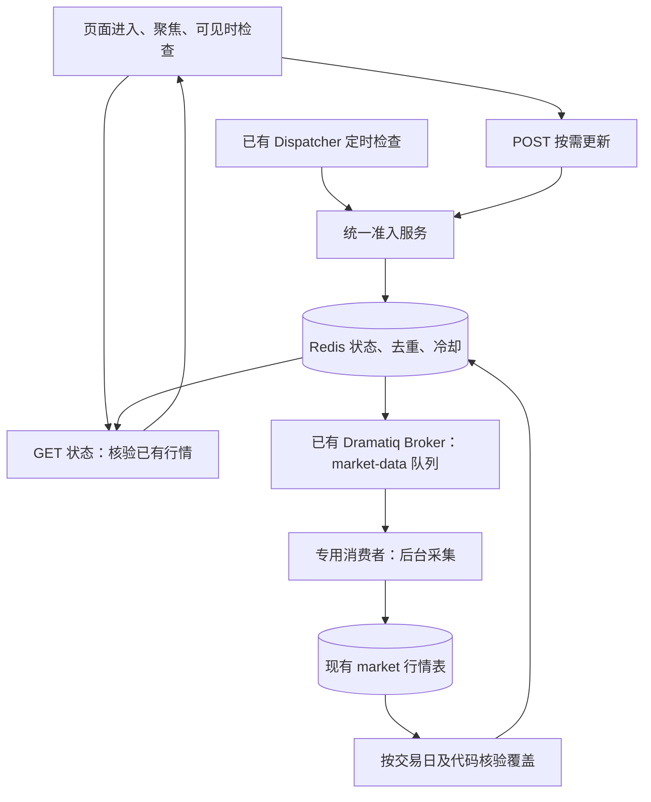

# 市场数据自动补齐技术方案

> **状态**：实施中（2026-09-24）；方案 R2 独立评审 PASS
> **关联文档**：[任务说明](README.md)｜[决策记录](decisions.md)｜[待验证项](issues.md)｜[API 契约](../../knowledge/backend/API契约.md)｜[前端平台](../../knowledge/frontend/前端平台.md)

**实施期事实修订（2026-09-24）**：真实源核验发现 DC 成分中有三个代码尚不在逐状态、逐交易所的完整 `stock_basic` 目录，故 `CN_STOCK_DAILY` 分母改由 `market.instrument` 股票主目录定义，目录内未知生命周期仍 fail-closed，旧冻结任务的目录外成分核验退出。`suspend_d` 必须用 `trade_date` 并校验返回日期及 S/R，只有 S 证明无应有行情；旧 `suspend_date` 请求被代理忽略且截断。`dc_daily` 对 BK0165.DC 单日漏行，定向补采在目标日缺**有效** OHLC 时才调用东财原始 K 线，并校验代码、日期、数值后写既有 `sector_daily`。上述均复用原表、Worker、锁和近三日范围，无新增表或调度系统；真实 API 已验证两组目标日 FRESH。详见 [工作日志](log.md) 与 [待验证项](issues.md)。

## 一、背景与动机

| 维度 | 现状 | 问题 | 目标 |
|------|------|------|------|
| 数据更新 | `run.sh:start_all` 启动一次 `backend.workers.market_ingest`；旧定时器只挂在 `AI/eventStudy/api/main.py` | 本次只读核查：指数及 dc 板块最大交易日均为 2026-09-21；22 日上午采集日志显示当日日线为空，收盘后没有补齐 | 页面访问能补漏，无页面访问也能定时补齐 |
| 日期判定 | `MarketDataService._last_trading_day` 使用 UTC clock 的 date；`CNCalendarAdapter` 只有 SSE 日历 | 中国 23 日凌晨 UTC 仍是 22 日；US/KR 复用 CN 日历会错判休市、跨日及应到日期 | 按标的市场、交易日及数据发布缓冲判断 |
| 采集范围 | `collect_incremental` 同时刷新基础信息、全部指数、股票基金、量化因子、板块和周刷 | 为一张过期指数卡触发全流程，会带上约千个板块及无关量化采集 | 按数据组补缺，不让页面刷新成为全量采集入口 |
| 完成判定 | `market_ingest.main` 增量路径仅以摘要顶层是否存在 `error` 决定退出码 | 摘要子项失败仍可能退出 0；某个指数有新行也不能证明其他指数完整 | 数据逐项核验，完成状态和数据新鲜度分开 |
| 板块展示 | 页面初始化 `todayLocalDate()`；tree 路由将 `from` 作为 `as_of`，服务返回传入日期 | 请求 22 日时仍能按历史窗口算热度，返回 `as_of=22`，但当天板块及成分股涨跌幅都是 null | 默认展示有行情的交易日；请求日期与实际数据日期明确区分 |
| 缓存 | 指数 query 设置 `refetchOnMount:false`，全局关闭窗口聚焦刷新 | 入库后页面不会自动获知变化；重开某个卡片不一定重新请求 | 更新进度可见，入库后精准刷新查询 |

**范围**：市场概览的 CN/US/KR 指数、CN 指数技术因子、dc 板块、板块成分股所依赖的 CN 股票日线，以及趋势对比。保留现有日线产品定位。

**不在本次范围**：分时/实时行情、用户任意历史回填、量化策略 qfq 因子全量维护、基金行情自动补齐、行业/概念成分体系的周期重建（空库首次人工初始化见 4.1.1）、宏观新闻采集、AI 分析。既有维护命令仍可执行这些操作，但不得绕过公共采集互斥。

## 二、架构设计

**本功能不新增 PostgreSQL 表，不新增数据库字段或迁移。** 行情真相仍在现有 market 表；更新任务、进度、去重和冷却是可重建的运行状态，放到已有 Redis。Redis 状态丢失允许重查与幂等补采，不要求永久任务审计或恰好执行一次。



- 复用现有 Redis 客户端与 Dramatiq Broker，新增 `market-data` 队列和独立消费进程，不让板块长任务占用 AI 分析线程。无需另建 PG 队列或 outbox。
- API 只做短查询与准入；已有 Dispatcher 负责定时补漏、未投递任务补发和有限重试。
- 新任务状态与 Broker 消息不承诺跨写入原子性：先原子写 Redis QUEUED 状态，再发消息；Dispatcher 定期补发未领取任务。重复投递由任务 ID、所有者 token 及执行锁消化。
- Redis TTL 锁控制准入与运行状态；实际采集使用**现有 PostgreSQL 的 session advisory lock**防重，无需建表。长任务即使 Redis 重启/TTL 过期，也不能与旧进程同时写行情。只保留这一处数据库锁能力，不再引入 PG 任务表、租约表或持久版本字段。
- 已有 compose Redis 开启 AOF，可减少正常重启时的状态损失；设计不依赖 AOF 完全不丢数据。Redis 全部重建后，以现有行情重新核验并创建缺失任务。

### 2.1 Redis 状态设计

key 前缀统一 `liveprofit:market-refresh:`，以下表格省略该前缀。复用平台 `resolved_redis_url()`，不得连到事件研究另一个 Redis DB。所有 mutation 封装到一个 `RedisRefreshStore`，不散落在路由。

| key | 类型 | 内容与用途 | 生命周期 |
|-----|------|------------|------------|
| `resource:{resource}` | Hash | 六组各一份 current_job_id、target_trade_date、status、自动/手动冷却、delivery_blocked、dispatch_epoch；指向当前调度状态 | 固定六个 key 不过期；每次准入修复已过期 job 指针，目标切换时替换内容 |
| `job:{job_id}` | Hash/JSON 字段 | resource、冻结目标日/代码/缺口、trigger、attempt、状态、进度、结果、error、created/started/finished、dispatch_at、dispatch_count、run_token、heartbeat_at | QUEUED/RETRY_WAIT/RUNNING 不过期；终态后 24 小时；六组各最多一份活跃 job，恢复完成后才设终态 TTL |
| `lock:{resource}` | String | 本轮运行随机 token；SET NX PX 准入，Lua 比较后续期/释放 | 180 秒，15 秒续期 |
| `budget:{resource}` | Sorted Set | 实际尝试开始时刻，member=job_id:attempt；滚动 24 小时限额 | 48 小时，写入先清除过期 member |
| `attempts:{resource}:{target_date}` | Hash | 该目标日累计自动轮数、最近尝试和冷却；不因 job 24h 过期而清零 | 当前目标及仍有活跃任务的旧目标不设 TTL；目标已切换且旧任务终态后才设 7 天清理 TTL，真实 Redis 丢失的历史次数无法恢复 |
| `coverage:{resource}` | String(JSON) | 实际 PG 核验摘要、checked_at、目标日/覆盖数及 data_version | 60 秒；可直接删除重建 |
| `changed:{resource}` | String | 最近成功提交后的随机变更标记，辅助前端立即失效 | 7 天；不是数据库事务版本 |
| `worker:{worker_id}` | String(JSON) | boot_id、idle/busy、current_job_id、heartbeat_at；用于在线/空闲投递判断，不授予写入权限 | 45 秒，15 秒更新 |
| `factor_cooldown:{symbol}:{from}:{to}` | String | 个股交互补因子的短期调用门控；所有自动 bars 刷新走 cache_only，不调用源 | 15 分钟，取得公共 PG 锁并准备拉源时才 SET NX EX；失败不删除以防重复轰击 |

状态值仍为 `QUEUED/RUNNING/RETRY_WAIT/SUCCEEDED/PARTIAL/FAILED/CANCELLED`。job_id 是应用生成 UUID，不是表主键。任务详情过期后返回 404（前端显示“记录已过期，重新检查行情”），不新增永久历史查询能力。

Lua 原子操作：① 同资源准入/复用当前 job；② claim：验证 current_job_id、状态、预算并设置 token/attempt；③ token 匹配的续期、进度和终态；④ 配置范围内的 retry。脚本内只操作 Redis；日历与 PG 核验在外面执行，claim 后采集前再核验一次，避免准入快照过期导致重复拉取。

不做 `data_version` 数据库字段。对外使用不透明 `data_version`：由 PG 覆盖摘要（代码/日期覆盖、行数、max(updated_at)）和 Redis changed 标记组合生成。写库成功后尽力更新 changed/删除 coverage，失败不能回滚或重报已提交行情。摘要不是严格事务变更日志，因此页面每 5 分钟还会重新读取活跃行情作为兜底，不能仅依赖 hash 捕获所有历史修订。

## 三、设计概览

### backend

#### 状态存储与读模型

| 具体对象 | 修改范围 | 主要文件或目录 | 交付行为变化 |
|----------|----------|----------------|--------------|
| RedisRefreshStore【新增】 | Redis key/TTL、Lua 准入/CAS/续期/预算 | `backend/modules/market_data/infrastructure/redis_refresh_store.py` | 多页面共享任务状态，无新增业务表 |
| 覆盖读模型【新增】 | 查询既有表，计算六组覆盖及实际日期 | `backend/modules/market_data/infrastructure/refresh_repository.py` | 状态丢失后可以从行情重新构建 |

#### 采集与 Worker

| 具体对象 | 修改范围 | 主要文件或目录 | 交付行为变化 |
|----------|----------|----------------|--------------|
| 定向采集【新增/修改】 | 按目标参数采集、逐项提交与核验 | `db/instrument/ingest/refresh.py`、`incremental.py`、`sector_daily.py`、`frames.py` | 只更新缺失域；已完成项失败后不重拉 |
| 状态与因子 DAO【修改】 | 可信停牌事实 upsert、bfq 列白名单写入，保留旧 limit/qfq | `db/instrument/dao/trade_status.py`、`factor_daily.py` | 复用现有表，Redis 丢失仍能识别停牌，交互补拉不覆盖 qfq |
| 目录与状态采集【修改】 | 独立状态 helper、DC 目录初始化参数 | `db/instrument/ingest/stock_factors.py`、`sectors.py`、`backend/workers/market_ingest.py` | 初始化不拉全量日线；状态不依赖 qfq 成功 |
| 公共执行锁【新增】 | 全部入口复用 PG 互斥和写入围栏 | `db/instrument/ingest/guard.py` | CLI、旧批处理与页面更新不并发抢接口 |
| Market Worker【新增】 | 复用 Broker 的专用队列消费者、子进程监督、存活状态 | `backend/workers/market_refresh.py` | 采集不阻塞 API 或 AI 分析 |
| Dispatcher【修改】 | 每 60 秒检查准入/到期重试/孤儿任务 | `backend/workers/dispatcher.py` | 无页面访问也补漏，睡眠唤醒后恢复 |

#### 服务层

| 具体对象 | 修改范围 | 主要文件或目录 | 交付行为变化 |
|----------|----------|----------------|--------------|
| 更新策略与服务【新增】 | 日历、ready_at、覆盖、Redis 原子准入和结果 | `backend/modules/market_data/application/refresh_policy.py`、`refresh_service.py` | 自动与手动遵守同一规则 |
| 市场日历【修改/新增】 | 多市场 session 与收盘时刻 | `backend/modules/market_data/infrastructure/calendar_adapter.py` | US/KR 不再复用 CN 日历 |
| 行情读服务【修改】 | 新鲜度统一、概念有效日期和覆盖 | `backend/modules/market_data/application/service.py` | 默认榜单随真实数据更新 |

#### DTO 与契约

| 具体对象 | 修改范围 | 主要文件或目录 | 交付行为变化 |
|----------|----------|----------------|--------------|
| 更新状态/请求 DTO【新增】 | 明确日期、任务、重试、版本 | `backend/api/schemas/market_refresh.py`、OpenAPI 及生成客户端 | 前端不用自行猜交易日 |
| 概念树 DTO【修改】 | 增加日期模式、有效日及覆盖信息 | `backend/api/schemas/market.py` | 请求日期与行情日期不混淆 |

#### API 路由

| 具体对象 | 修改范围 | 主要文件或目录 | 交付行为变化 |
|----------|----------|----------------|--------------|
| 更新路由【新增】 | 三个端点，统一 envelope/problem | `backend/api/routers/market_refresh.py`、`backend/main.py` | 查询与采集触发分离 |
| tree/hot、stock bars 路由【修改】 | 默认最新数据模式、历史日期显式传入，stock bars 增加 factor_policy | `backend/api/routers/market_data.py` | 不再强制 from→as_of |

#### 运行装配

| 具体对象 | 修改范围 | 主要文件或目录 | 交付行为变化 |
|----------|----------|----------------|--------------|
| Broker 测试装配【修改】 | configure_broker 增加可选 namespace（默认值保持现状），测试在全新子进程仅配置一次 | `backend/workers/broker.py`、integration/contract conftest | Broker 与业务 key 均按测试运行隔离，避免全局单例串库 |
| 启停与配置【修改】 | 新 worker、配置项、容器连接校验 | `backend/cli.py`、`backend/bootstrap/settings.py`、`pyproject.toml`、`uv.lock`、`run.sh`、`docker-compose.yml`、`docker/Dockerfile.worker`（按镜像依赖需要） | 本地与容器都能真正启动采集执行面 |

### frontend

#### API 接入

| 具体对象 | 修改范围 | 主要文件或目录 | 交付行为变化 |
|----------|----------|----------------|--------------|
| 更新 query/mutation【新增】 | 可见轮询、聚焦检查、按版本失效 | `frontend/src/modules/market/pages/refreshQueries.ts`、`frontend/src/api/queryKeys.ts`、生成客户端 | 后台入库自动反映到页面 |

#### 页面区块

| 具体对象 | 修改范围 | 主要文件或目录 | 交付行为变化 |
|----------|----------|----------------|--------------|
| 更新状态栏【新增】 | 组日期、进度、错误、手动重试 | `frontend/src/modules/market/pages/MarketRefreshStatus.tsx` | 更新过程和缺失原因可见 |
| 板块与指数【修改】 | 最新/历史模式，跨日参数，保留图表交互 | `HotConceptsPanel.tsx`、`MarketIndicesPanel.tsx`、`TrendComparisonPanel.tsx`、`queries.ts` | 不显示伪当天榜单，不重置历史选择 |

#### 页面集成

| 具体对象 | 修改范围 | 主要文件或目录 | 交付行为变化 |
|----------|----------|----------------|--------------|
| 个股图【修改】 | 自动读取 cache_only，用户打开或扩展范围才显式 ensure 并回填查询缓存 | `frontend/src/modules/market/components/KLineDialog.tsx`、stock bars 所在 `queries.ts` | 缓存失效不重复拉因子，保持交互补拉能力 |
| 市场概览【修改】 | 页面单一协调器，不在每张卡各自触发采集 | `frontend/src/modules/market/pages/MarketOverviewPage.tsx` | 一页一次检查与提交 |

### AI

#### Provider 接口

| 具体对象 | 修改范围 | 主要文件或目录 | 交付行为变化 |
|----------|----------|----------------|--------------|
| 交易状态与数据调用【修改】 | 保留既有行情接口；停牌源 None 不当成成功空集合；新增调用沿用真实端点超时 | `AI/dataflows/providers/cn/tushare.py`、对应 Provider 单测 | 缺行情不能被错误标为合法停牌或完整 |

#### 批处理接入

| 具体对象 | 修改范围 | 主要文件或目录 | 交付行为变化 |
|----------|----------|----------------|--------------|
| 旧市场采集步骤【修改】 | 接入公共锁及版本推进，不另建刷新调度器 | `AI/eventStudy/scheduler/daily_job.py`、`backend/workers/market_ingest.py`、`db/instrument/ingest/backfill.py` | 手工维护与自动更新互相可见 |

## 四、详细设计

### 4.0 模块总览

| 维度 | 问题 | 方案概览 |
|------|------|---------|
| 4.1 应有交易日与覆盖判定 | `_last_trading_day()` 不区分 CN/US/KR，单个最新行掩盖缺口 | 六组独立目标日，逐标的覆盖，未知日历不触发 |
| 4.2 任务准入与生命周期 | `run.sh` PID 文件只保护该脚本入口，子项失败仍可能退出 0 | Redis 状态和 token、PG 无表执行锁、有限重试与核验 |
| 4.3 定向采集与后台运行 | `collect_incremental` 为页面更新带上整套采集，板块约千次请求 | 小组定向执行，独立 worker，所有入口公共锁 |
| 4.4 API 与查询语义 | tree 返回请求日期 22，但 22 日没有行情 | 只读状态+显式触发，最新数据模式和历史模式分开 |
| 4.5 前端自动更新体验 | `refetchOnMount:false` 且板块默认今天，后台入库不可感知 | 页面协调器、可见轮询、版本失效、保留历史交互 |
| 4.6 上线与验证 | `start_platform` 只启动三进程，已有测试 fixture 未隔离刷新 Redis key | 完整启停装配、Redis/PG 测试隔离及验收矩阵 |

### 4.1 应有交易日与覆盖判定

#### 4.1.1 模块设计

**日期算法**：对资源 r 和 UTC 时刻 now，遍历其市场 session，`ready_at(r,d) = session_close(d) + publish_lag(r)`；`expected_trade_date = max(d where ready_at(r,d) <= now)`。先转换市场时区/日历，禁止 `date.today()`、UTC date 或“周一至周五”替代交易日历。收盘与已发布是两个不同概念。

以下为**拟定配置值，非数据源 SLA**。CN 初值复用既有 `TUSHARE_DATA_READY_HOUR=20` 的保守口径；正式上线前记录代理端点实际到数时间，再调整缓冲。

| resource | 目标集合 | 时区/日历 | 发布缓冲初值 | 完整条件 |
|----------|----------|-----------|--------------|----------|
| CN_INDEX_BARS | `INDEX_TARGETS` 的 11 个 CN 指数，含趋势对比用指数 | Asia/Shanghai / XSHG | 收盘后 5 小时，常规日 20:00 | 目标代码在目标交易日均有非空 OHLC |
| CN_INDEX_FACTORS | 同上 11 个指数 | 同 CN | 5 小时 | 每代码目标日 `KLINE_FACTOR_COLUMNS` 必需值完整；不能只检测存在一行 |
| US_INDEX_BARS | `.INX/.DJI/.IXIC` | America/New_York / XNYS | 4 小时 | 三个指数逐项完整，无 CN 因子要求 |
| KR_INDEX_BARS | `KS11` | Asia/Seoul / XKRX | 4 小时 | OHLC 完整，无 CN 因子要求 |
| CN_STOCK_DAILY | 当前库内股票与 dc 成分股并集；排除日线源范围外的 B 股 `20xxxx.SZ` / `900xxx.SH`，其余按上市/退市日期过滤 | 同 CN | 5 小时 | 逐股票有目标日日线及 pct_chg，或可信目标日停牌事实；未上市/已退市作排除项 |
| CN_SECTOR_DAILY | 库内 dc 板块字典，按代码冻结 | 同 CN | 5 小时 | 逐板块有目标日 OHLC、pct_chg；无行情不自动剔除代码 |

- 指数 bars 与 factors 分组：价格已更新但技术指标未到时，不重复重拉价格，也不把指标问题隐藏。
- 个股完整定义为“有有效行情或已证明无需行情”，不是 100% 股票必须有成交。停牌源失败/未知不能当成已停牌；无法证明的缺口保持 PARTIAL。`get_full_market_trade_status_df` 当前将 `suspend_d=None` 视为空集合，需要修正为不可用，相关量化消费回归测试同步覆盖。
- **冷启动边界**：固定指数的目标集合来自 `INDEX_TARGETS`，即使 instrument 表为空也允许建指数任务，Worker 在公共执行锁内调用参数化 `_bootstrap_instruments` 后采集。股票/板块目录为空则返回 `CATALOG_UNAVAILABLE`，页面提示先初始化，不承诺页面自动重建成分体系，也不得 `0/0=完整`。
- 为股票/板块提供明确维护入口：`backend.workers.market_ingest --initialize-catalog` 执行股票基础目录和 dc 板块字典/成员初始化（`collect_sectors` 使用显式 `sources=("dc",)`，默认保持原双源行为）；目录完整、板块成员已有而仅股票生命周期缺失时，可加 `--stock-directory-only` 跳过逐板块成员刷新。两种模式受同一公共锁保护，不运行 qfq、基金或 AI；股票目录提交后只失效 CN_STOCK_DAILY coverage。未执行维护前保持可理解的 BLOCKED；非 B 股候选中出现缺失股票元信息时，仅由 stock_basic 维护补齐，不把未知生命周期字段假定为已上市。
- **实现阶段发现的目录根因（2026-09-24）**：`AI/dataflows/providers/cn/tushare.py::get_stock_basic_df()` 过去省略 `list_status`，官方接口默认只返回 `L`；此前授权同步的 5568 行因此不能证明覆盖完整生命周期。`stock_basic` 单次最多 6000 行，随 A 股数量增长还会触及截断上限。修正后按 `L/D/P/G/UN × SSE/SZSE/BSE` 分区显式查询；任一请求失败、过滤返回状态不符或某分区达到 6000 行都整体拒绝输出，避免把局部结果当完整目录。源 `UN` 映射为现有 `market.instrument.list_status CHAR(1)` 中的 `U`，不加列、不建表；G/U 无上市日期时按明确未交易排除，有上市日期则只在该日及之后进入日线目标。上次对三个缺失代码的定向查询同样省略状态过滤，因此它们是否属于 G/UN 尚待按新查询方式重新核验，当前推断不能当成已确认事实。
- DC 成分包含不在 A 股日线源范围内的 B 股（如 `200011.SZ`、`900901.SH`），不应阻止整个 A 股目录准入；已冻结的旧任务核验时也将这两类代码按不在目标范围处理，避免继续请求上游或永久重试。未知生命周期的其他代码（如不完整目录中的 `001246.SZ`、`301716.SZ`、`920201.BJ`）仍 fail-closed，只有取得可靠源元数据后才能解除。
- 板块 dc 无可靠退市字段，消失代码保持缺失并进入有限重试，不靠“多次取不到”自动删目录。
- `latest_observed_date`：组内任一真实行情的最大日期，仅供诊断。`complete_through_date`：本次检查的最近 3 个交易日内，逐项确认覆盖完整的最大日期；不存在完整日则 null。它不代表历史连续完整，也不因末日完整忽略窗口内部缺口。二者不能互换。
- **覆盖计数**：顶层 `expected_count/available_count/exempt_count/missing_count` 仅统计目标日代码，满足 `expected = available + exempt + missing`。未上市/已退市不进该日分母；有有效行情的代码优先计 available，已知停牌且无行情才计 exempt，不能双计。生命周期未知的目录项作为 missing 并带 reason，不能凭空排除。
- 新增 `window_coverage={from,to,expected_count,available_count,exempt_count,missing_count}`，按每个交易日独立过滤生命周期后对 `(code,trade_date)` 求和，满足同一恒等式。例如 11 个指数目标日 11/11，但前一日缺 1：顶层 missing=0，窗口 expected=33、available=32、missing=1，freshness=PARTIAL。`job.processed/total` 统一是冻结 target_spec 中缺失的 code/date 单元数量，批量接口返回后逐单元记账；处理过的失败单元可计 processed，但 result.completed 只计实际通过覆盖核验的单元。
- 自动补齐窗口是截至目标日最近 **3 个已到发布时间的交易日**，既补末日也补窗口内缺洞；超过窗口的长期缺口展示 `HISTORY_GAP`，交给显式维护命令。指标消费所需更长历史沿用已有按需加载，不在页面触发全历史。
- 按目标代码/日期检查，不使用跨资源全表 `max(trade_date)`，不因 US 单只指数最新而宣布 CN 或其他 US 指数完整。
- 状态枚举为 `FRESH/STALE/PARTIAL/UNAVAILABLE/UNKNOWN`：目标日及本次短窗口齐全为 FRESH；目标日零覆盖但有旧数据为 STALE；有部分目标覆盖或窗口内缺洞为 PARTIAL；从未有可用数据为 UNAVAILABLE；日历不可判定为 UNKNOWN。失败任务状态独立展示，当前已补齐的数据不被旧失败状态覆盖。
- 新鲜度 GET 优先读 60 秒有效覆盖摘要；过期只做本地 SQL 核验，不调用 Provider。GET 不提交任务，Redis 摘要缓存写入由 Dispatcher/采集结果服务负责；日历运算为进程内只读、缓存计算。

**日历能力**：新增适配器锁定 `exchange_calendars==4.13.2`，CN/US/KR 分别 XSHG/XNYS/XKRX。本轮隔离 POC 已确认：XSHG 当前 2026 年 242 个 session 与项目 CN 缓存完全一致，2027 年构造明确失败；XNYS/XKRX 的 2026/2027 年可构造。采用“已验证范围可上线，越界明确 UNKNOWN”的方案，不要求尚未公布完整数据的未来年份先验通过，也不声称支持 2027 CN。

适配器输出 `calendar_status=OK|EXPIRING|UNAVAILABLE`、`supported_through`。CN 支持至 2026-12-31，US/KR 本稿验证至 2027-12-31；距支持边界 30 个自然日起 EXPIRING 并提示更新依赖/核验交易所公告，不影响仍在范围内的目标判断。只在已支持范围构造 schedule，不能为求 next_ready_at 一口气请求整个不支持年份。当前目标可算但下一个 session 超范围时，保留当前 expected/freshness，`next_ready_at=null`；市场本地当前日期本身超出支持范围后，freshness=UNKNOWN、expected=null、自动与手动均不准入，保留实际已有日期/行情供阅读。各市场独立降级，CN 越界不阻止 US/KR 更新。

更新日历版本后先做隔离 POC 并更新 supported_through，再重建进程缓存；不使用 weekday fallback。原 AI CN 日历接口保留，平台新鲜度/更新策略使用新适配器；当前年已核对一致，未来版本仍做集合对比。

示例（假定 21、22、23 日均为该 CN 日历交易日）：23 日 00:10，目标是 22 日；23 日 10:00 仍是 22 日；23 日 20:00 才要求 23 日日线。US 按纽约日期及 DST 单独计算，不能在北京时间零点换目标。

#### 4.1.2 三方依赖能力评估

已查 [官方用法](https://github.com/gerrymanoim/exchange_calendars)、[日历注册表](https://github.com/gerrymanoim/exchange_calendars/blob/master/exchange_calendars/calendar_utils.py)，并完成本地隔离实测，证据见 [calendar-poc.md](attachments/calendar-poc.md)、[原始 JSON](attachments/calendar-poc.json)、[可复现脚本](attachments/calendar_poc.py)。版本 4.13.2 可在项目 pandas 3.0.5/numpy 2.5.1 上运行，纽约 DST/提前收盘抽样通过，CN 当前年与缓存集合一致；XSHG 2027 不支持，已按 4.1.1 定义为维护边界。额外依赖只安装在 var 隔离目录，未修改项目 .venv/uv.lock；正式实现时再锁项目依赖。

代理端点的返回窗口、升序归一、单日截断和指标来源遵循 [现有端点实测](../../memory/pitfalls/ai/tushare-endpoints.md)。发布缓冲是本项目调度策略，不以官方市场收盘时间冒充代理发布保证。

Tushare [stock_basic 文档](https://tushare.pro/document/2?doc_id=25) 明确说明 `list_status` 支持 `L/D/P/G/UN`、缺省为 `L`，并声明单次最多 6000 行；端点也支持 `exchange` 分区。实现逐状态、逐 SSE/SZSE/BSE 调用，并校验响应保留请求的状态/交易所筛选及行数上限。每次维护共最多 15 次顺序只读请求（低于文档 50 次/分钟限制）；官方文档不证明自建代理完全同构，所以代理若拒绝某筛选会整体失败并继续保留已有目录，不把部分结果提交为成功。

#### 4.1.3 风险与验证方式

纯函数注入 clock/session 表，覆盖北京时间零点、盘中、截止前后一分钟、周末、长假、纽约 DST、提前收盘、日历不可用；PG 测试构造“10/11 指数齐全”“行情齐但因子空”“停牌已知/未知”“中间交易日缺洞”。

#### 4.1.4 文件变更清单

新增 `refresh_policy.py`、`refresh_repository.py`；修改 `calendar_adapter.py`、`service.py`、`pyproject.toml`、`uv.lock` 及 Tushare 交易状态失败语义。相关路径见第三章；不删除原 AI 日历。

### 4.2 任务准入与生命周期

#### 4.2.1 模块设计

`ensure_refresh(resources, trigger, now) -> decisions[]`：先计算应有日期、核查 PG，再通过 Lua 原子准入。完整返回 UP_TO_DATE；日历或股票/DC 目录未知返回 BLOCKED（固定指数集合来自配置，不受空 instrument 目录阻塞）；同资源已有活跃任务返回同 job_id；冷却和预算未满足返回 COOLDOWN/RETRY_LIMIT；否则写 QUEUED 状态，再按下述 worker 门控投递 `market_refresh(job_id)`。

**状态流转**：`QUEUED → RUNNING → SUCCEEDED`；可重试失败为 `RUNNING → RETRY_WAIT → QUEUED`；预算用尽按实际已有成果转 PARTIAL/FAILED。旧目标未运行时可取消并让新目标窗口覆盖；正在运行时冻结目标不修改，结束后再检查新目标。目标代码集合变化按相同目标日预算重规划，不能新建 job_id 绕过限流。

**复用 Broker**：新增 Dramatiq actor，`queue_name="market-data", max_retries=0`；专用 Worker 只订阅此队列，单消费线程；已有 AI Worker 继续仅订阅 default。Actor 仅传 job_id，具体 spec 取 Redis，禁止传 shell 命令。业务重试全部由 Dispatcher 决定，不叠加 Broker 自动业务重试。Redis job 已过期、已完成、current_job 不匹配的旧消息直接 ACK 丢弃。显式设置 actor 超时大于子进程 90 分钟上限及退出等待时间（初值 95 分钟），finally 必须回收子进程；不能沿用不匹配的默认时限。

**有界投递与补发**：QUEUED 表示业务准入成功，未必已写入 Broker。无在线 worker 时只保留状态，一条消息也不投递；在线但 busy 时允许每个新 job 首次投递一次，之后暂停补发，不靠每分钟复制消息等待。在线且至少一个 worker idle 时，才允许补发；无反馈的第 2/3 次投递分别距上次 5/15 分钟。Lua 在发送前原子预留 `(job_id,dispatch_epoch,dispatch_count,dispatch_at)`，多 Dispatcher 只有一个取得发送资格，send 后崩溃最多消耗一次投递名额。

每个执行轮次最多 3 次投递；真实 send 异常也计数，不无限重发。达到上限且仍未领取时写 FAILED/DELIVERY_UNCONFIRMED，并在 resource 保留 delivery_blocked：自动 ensure 不能靠新 job 重置它；仅显式手动 retry（至少 5 分钟）解除并开新投递 epoch。Worker 从离线恢复时如本轮尚有名额，在空闲时一次补发，不按离线分钟数补历史积压。任何 current_job/status 不匹配的过期消息直接丢弃。

有上游执行失败并经过业务退避进入新执行轮次时，才重新设置本轮 3 次投递额度。公共 PG 锁忙导致尚未拉源的回退不重置 dispatch_count；再次投递前尝试公共锁可用性检查，执行时仍重新取锁。上线前测试：离线 1 小时发 0 条；已有 worker 忙 90 分钟时每 job 至多 1 条；长期在线空闲但消息始终丢失时至多 3 条、之后显式阻塞。Redis 队列/状态全部丢失属于另行重建边界。

**重试预算**：同资源目标日自动最多 3 轮，第一次立刻、失败后分别冷却 15/60 分钟。手动 retry 仍受 5 分钟最低冷却、执行锁及同资源滚动 24 小时最多 6 次实际尝试约束。预算与 claim 同一 Lua 中记账；首次公共执行锁未取得且尚未调用上游时回退 QUEUED并撤回本次记账，30 秒后可重新检查公共锁；真正重投仍遵守本节 5/15 分钟退避与每轮 3 次投递上限。预算保存在 Redis，数据彻底丢失后历史尝试次数不可恢复；这是可接受边界，不宣称永久硬限额。当前目标 attempts 必须 PERSIST（不设置 TTL），即使 Dispatcher 离线 10 天也保留次数；只有目标已经切换且旧任务终态，Lua 才给旧目标计数设置 7 天清理 TTL。删除/过期短期 job 时不删除当前目标计数，长假不能靠正常 TTL 重置自动 3 轮。

本机网络策略拒绝（Windows `WinError 10013`）是执行环境配置错误，不是可靠退避恢复的上游暂不可用。Tushare 的结构化 Provider 接口仍按契约返回 `None`，同时保留 `SOURCE_NETWORK_ACCESS_DENIED` 类型错误；数据库采集边界检查该错误并立即停止当前单元，避免把它吞成普通空响应。Worker 停止该资源的本轮采集并核验已提交行情；Redis 将资源自动准入置为该错误阻塞，不继续消耗自动重试，状态说明要求修复 Worker 出站网络后由用户手动重试。新的手动请求清除该自动阻塞并重新验证网络；普通超时/上游空结果仍走既定有界重试。

**执行互斥与故障恢复**：

1. Actor 原子 claim 后启动采集子进程，子进程用**实际写行情的同一个 PG 会话**获取全局 session advisory lock；锁覆盖所有逐项 commit，所有旧 CLI/批处理也接同一把锁。取不到锁不访问上游，退回排队。
2. Redis 每 15 秒比较 token 后续期 180 秒；写进度/完成和释放锁都比较 job_id/current_job/token，旧任务不得删除或覆盖新任务状态。不能用普通 DEL 或“GET 后 DEL”代替原子比较。
3. 每个采集单元在拉取前、写入前确认 token；token 丢失/Redis 不可用则停止启动新单元，回滚尚未提交事务并退出。Redis 检查与 PG 提交不是跨库原子操作，极短窗口内可能有一笔已授权数据提交；PG session 锁保证此时没有第二个采集写入者，幂等 upsert 保证已提交数据可复用。
4. Redis TTL 到期或数据清空本身**不意味着旧执行已停止**。Dispatcher 先确认 PG 公共锁可获取才恢复过期 RUNNING；取不到时显示 WORKER_STALLED，暂不重发。锁检查后仍可能被其他入口取得，因此实际执行必须再次获取。PG 写连接断开后子进程必须退出，不准自动重连继续写。
5. Worker 父进程监督子进程超时（90 分钟）、退出和 stop；terminate 等待 10 秒、kill 后 wait 最多 20 秒，只处理自己的子进程，不按陌生 PID 杀进程。退出回收总宽限 30 秒，低于 actor 95 分钟与子进程 90 分钟的差额。子进程另设硬超时 watchdog，应对父进程死亡；Redis 失联在控制线程中同样触发停止。历史运行状态在 Redis 丢失时不保证恢复，但行情可继续补齐。
6. PG commit 后 Redis 状态上报失败：视为“结果待重新核验”，不能把有效行情当失败回滚。下一次核验先检查 PG，已齐则直接完成，不再次拉取。

**故障降级**：Redis 不可用时 GET 尽可能从 PG 返回实际日期并附 `refresh_available=false`；POST 返回可重试 503，不绕过互斥直接采集。Redis 恢复后 Dispatcher 先做一轮只读覆盖核验，确认自身可用再准入；消息缺状态则丢弃，由核验补回。现有 AOF 是运行保障，不代替这些恢复分支。

#### 4.2.2 三方依赖能力评估

现有平台已有 sync/async Redis 客户端、RedisBroker、Windows 进程内 Dramatiq Worker 模型。事件研究 `review_adapter.py` 已有 SET NX PX 和 Lua 比较释放先例。本方案扩展续期与任务状态，不引入新的队列库或 Redis 服务。PG advisory lock 复用现有连接能力，不涉及 DDL。

#### 4.2.3 风险与验证方式

隔离 Redis DB + 测试 PG 的集成测试：并发 POST 返回同 job；重复消息只执行一次；Redis TTL 过期但 PG 写会话仍存活时第二任务不拉源；发送前后 crash 都可补发；Redis 重启/清空后重建；旧 token 不覆盖新状态；PG 提交后 Redis 报错仍保留行情。测试不允许 flush 生产 Redis。

#### 4.2.4 文件变更清单

新增 `redis_refresh_store.py`、`refresh_service.py`、`guard.py` 和专用 actor/worker；修改现有 Dispatcher 接线。**不新增任务状态 PG DAO、表、字段或迁移，不复用 market.ingest_state 承载刷新任务；现有行情 DAO 的事实写入 helper 按 4.3/4.4 修改。**

### 4.3 定向采集与后台运行

#### 4.3.1 模块设计

- Dispatcher 启动及每 60 秒调用相同 ensure 服务；逐资源最多每 5 分钟重算完整覆盖，窗口未到且无缺口只读取本地日历/摘要。重试准入按 next_retry_at；异常隔离，市场更新失败不终止原分析任务投递循环。
- 同一轮准入/补发按指数 bars → 指数 factors → 股票 → 板块的顺序投递，消费者按 Broker 可用消息执行；不承诺跨多次请求严格优先级，也不中断正在采集的板块。API 返回真实排队状态，不承诺指数能抢占千板块任务。
- 定向入口 `collect_refresh(conn, spec, progress, guard)` 只接收后端构造的类型化目标，不修改全局 `INDEX_TARGETS`。指数 `_ingest_index_bars_and_factors` 拆为可分别调用的 bars/factors helper，显式代码集/日期段；旧增量入口再组合调用，保持原用途。
- 股票新增 `fetch_stock_daily_frame(provider, trade_date, codes)`，复用 `frames.py` 的单日拉取和 ≥6000 行时每 100 代码降级能力；不得直接调用四接口股票+基金+复权的 `fetch_day_frames`。
- **停牌落库闭环**：新增中立 helper `collect_stock_status_day`（放 `db/instrument/ingest/stock_factors.py`，与 qfq 入口分离）调用 `provider.get_full_market_trade_status_df(trade_date)`；验证目标日期、唯一 ts_code、已知 bool is_suspended/is_st、market_board、source/updated_at，保留 up_limit/down_limit 可空口径。Tushare 的 suspend_d=None/截断不明返回不可用；只有已确认成功空集才能生成 false，不能凭行情缺行推断停牌。
- helper 写**现有** `market.trade_status_daily`，不调用 qfq 采集、不写量化 ingest_state 成功水位。状态 DAO 新增 `upsert_observed_trade_status`：只接收经验证的完整状态帧；INSERT 显式传所有既有字段，不靠 default 猜 is_st；冲突时更新有证据的布尔和板块字段，up_limit/down_limit 使用非空新值，空值不覆盖已知值。未知/失败帧完全不写，已有可信记录保留。行情与状态分别提交、分别核验；任一路失败仅该部分缺失。
- `refresh_repository` 按同日 JOIN trade_status_daily 判豁免；tree 的 coverage 也读同日已知状态，不读 Redis 内存事实。只有有可信状态行且 is_suspended=true 且当日日线缺失才豁免。测试预存非空涨跌停价/量化状态，刷新后不被空值抹掉；清空本功能 Redis 后停牌豁免仍可从 PG 重建。
- 板块 `collect_sector_daily_incremental` 增加明确 `codes`、`end_date`、progress/guard 参数；每次只拉未齐板块，沿用 dc 70 自然日窗口与逐板块 commit/连续 5 次失败熔断。过滤目标日期后入库，可保留源返回的窗口内有效历史，但不宣称超出源能力的旧缺口已补齐。
- 上游空结果分成 `UPSTREAM_NOT_READY` 与已知无交易；交易日仍缺失的数据不能因返回空 DataFrame 标成成功。数据返回日期、重复键及必需列先验证；真实已有的旧行情不删除，不写零值占位。
- 每个代码/单日工作单元提交后尽力更新 Redis 变更标记和进度；重试前从 DB 重算缺失，避免重拉已完成项。进度区分“已处理/总数”和“已补齐/必需数”，不把跳过或失败算作成功。
- **公开入口清单**：`collect_incremental`、`run_backfill`、直接维护入口 `backfill_index_history`、`run_stock_factor_backfill`、`collect_sector_daily_incremental`、`collect_sectors`、`collect_stock_quant_day`、新增 `collect_refresh/collect_stock_status_day` 和交互因子补拉均接公共 guard。CLI/daily_job 从这些公开入口调用。公开函数是 locked wrapper，组合流程调用私有 `_..._unlocked` helper 并显式传既有 guard，禁止在同一 conn 上重复获取 session 锁。实现时同步定向回填维护文档，从全局字典修改改为显式 codes 参数。
- guard 在采集作用域 `finally` 显式解锁，不能等 daily_job 的共享连接完成后续事件研究/AI 才释放。持锁连接一旦 closed/broken、DB SQLSTATE 08 类错误或恢复连接失败，抛 `IngestSessionLost`；全部逐项容错/rollback 分支必须重新抛该错误，旧 CLI 和批处理同样终止。每次源调用前和提交前调用 guard.assert_alive，禁止静默重连后继续；合法单项 SQL 错误只有 rollback 成功且会话仍有效才继续。
- 所有相关入口在提交行情后尽力更新 Redis changed 标记并清 coverage；不要求 PG+Redis 原子提交。旧 CLI 不可用 Redis 时仍可在 PG 公共锁下维护数据；页面通过 PG 摘要复核及 5 分钟活跃图表刷新发现变化。不把“缓存时间”当成行情日期。

低层 `db.instrument` 保持不依赖 backend：目标 spec 与回调协议定义在中立采集包，应用服务负责构造；CLI、旧批处理和 Worker 共用它。实施时搜索全部 `bulk_upsert_daily/bulk_upsert_factor_daily/bulk_upsert_sector_daily` 调用点，区分本方案六资源与其他域；个股交互补 bfq 的边界见 4.4，不误计入 CN 指数因子版本或引发全市场任务。

#### 4.3.2 三方依赖能力评估

继续调用现有 Provider/DAO，不引入实时行情源。新分组必须覆盖主源和已存在的兜底能力；某源不支持因子或停牌信息时明确 UNAVAILABLE，不能调用不存在的方法。代码参数可定向不等于代理支持任意区间批量；全市场严格单交易日。

#### 4.3.3 风险与验证方式

fake provider 记录调用：只缺 CN 指数时不调用板块/基金/qfq；已齐 1000 个板块仅缺 3 个时只拉 3 个；第 4 个失败不回滚前 3 个；错误行/旧日期不通过核验；断点重试保留有效数据。源调用真实耗时与超时边界在受控 POC 验证，不能把线程 Future 超时误当底层请求已停止。

#### 4.3.4 文件变更清单

新增 `db/instrument/ingest/refresh.py`、`backend/workers/market_refresh.py`；修改第三章列出的增量、frames、板块、回填、CLI 和旧 daily_job 接入点；同步来源标记、进度和事务失败 rollback。Tushare 生命周期筛选及本机网络拒绝分类涉及 `AI/dataflows/providers/base_provider.py`、`AI/dataflows/providers/cn/tushare.py`、`db/instrument/schema.sql` 注释、`backend/modules/market_data/infrastructure/refresh_repository.py`、`service.py` 与 Redis 重试门控；不新增数据库结构。

### 4.4 API 与查询语义

#### 4.4.1 模块设计

三个新接口均保持 `{data,meta}` envelope、trace_id 和现有 Problem Details。请求体禁止额外字段，resources 限定六个枚举、去重后最多 6 项；日期、代码集及脚本名不由浏览器控制。

| 接口 | 语义 | 响应 |
|------|------|------|
| `GET /api/v1/market-data/refresh-status` | 只读各组覆盖/任务/worker 状态；不触发上游采集 | 200，`server_time/refresh_available/groups/concept_display_date` |
| `POST /api/v1/market-data/refresh` | `{resources:[...], mode:"auto"|"retry"}`；auto=PAGE，retry=MANUAL | 有新入队/在飞任务为 202，否则 200；每组独立 decision/job_id/reason/next_retry_at（本次请求 mode 的准入时间） |
| `GET /api/v1/market-data/refresh-jobs/{id}` | 查询该组任务详情 | 200，进度/结果/截断缺失样例；不存在 404 |

GET 每个 group 字段固定：`resource/market/market_date/calendar_status/supported_through/expected_trade_date/next_ready_at/latest_observed_date/complete_through_date/freshness/expected_count/available_count/exempt_count/missing_count/window_coverage/data_version/auto_eligibility/manual_eligibility/job`。`market_date` 是服务端按该市场时区换算的当前日期，`next_ready_at` 是下一 session 预计满足发布缓冲的 UTC 时间。job 可空；非空含 `id/status/attempt/processed/total/started_at/heartbeat_at/error_code/error_summary`。`auto_eligibility` 与 `manual_eligibility` 均为 `{allowed,reason,next_retry_at}`，共用后端模式化策略，POST 仍在 Redis 原子准入及执行前复核。auto 关闭/自动 3 次耗尽只阻止 auto；manual 仍可在 5 分钟后且滚动预算未耗尽时允许，auto 自身保持 15/60 分钟退避。公共执行中、日历未知、目录缺失、Redis 不可用或滚动额度耗尽则两者都禁止。delivery_blocked 禁止 auto，manual 按 5 分钟门槛明确重置投递周期。

响应示例（设计样例，不是真实执行结果）：

```json
{"resource":"CN_INDEX_BARS","market":"CN","market_date":"2026-09-23","calendar_status":"OK","supported_through":"2026-12-31","expected_trade_date":"2026-09-22","next_ready_at":"2026-09-23T12:00:00Z","latest_observed_date":"2026-09-21","complete_through_date":"2026-09-21","freshness":"STALE","expected_count":11,"available_count":0,"exempt_count":0,"missing_count":11,"window_coverage":{"from":"2026-09-18","to":"2026-09-22","expected_count":33,"available_count":22,"exempt_count":0,"missing_count":11},"data_version":"coverage-a12:change-b34","auto_eligibility":{"allowed":true,"reason":"MISSING_DATA","next_retry_at":null},"manual_eligibility":{"allowed":true,"reason":"MISSING_DATA","next_retry_at":null},"job":null}
```

**概念查询修订（tree 与 hot 一起改）**：

- `as_of` 显式指定 = 历史模式，精确该日，不悄悄替换。`as_of` 省略 = latest 模式，由后端决定 `effective_as_of`。
- 删除 tree/hot 已无业务用途的 `from/to` 参数及前端 `from→as_of` 桥接，同步生成客户端、测试、API 文档。不引入 v2 并存；指数/板块 K 线自身的 from/to 不变。
- latest 模式使用**最近存在有效 dc 板块日线的实际日期**，不是请求今天，也不等待 1031/1031 全齐才显示。该日只以“当日有有效日线的板块”参与热度排序，避免缺行情的历史高热板块挤占 top30；成分股仍只 JOIN 同日，不能将昨日涨跌拼成今日。
- 返回 `requested_as_of`（latest 为 null）、`as_of`（实际查询日）、`date_mode=LATEST|HISTORICAL`、`coverage`。coverage.boards 统计该日有效目录的全部板块（非 top30）及其中有效行情数量；coverage.members 仅统计最终返回 top N 概念的**截断前成员关系**，单位 `(sector_code,ts_code)`，同一股票属于两个概念计两项，单概念内先去重。每概念超 100 的未展示成员仍进入覆盖分母；`expected=available+exempt+missing`，生命周期排除规则同 4.1。SQL 在 ROW_NUMBER 截断前完成覆盖聚合；已有 member_total 口径不改。hot 没有成分明细时 members=null，不伪造 0。
- 最新日部分入库明确显示部分覆盖；历史模式没有当日板块行情时返回空榜单/coverage.available=0，不把历史热度伪装当日。两模式均先筛“该日有有效日线”的板块，再按其可得历史窗口算热度。
- `concept_display_date` 为上述最近真实板块日，可能早于 expected，也可能晚于保守 ready_at 对应日期；展示真实已发布数据合法，但自动采集不追尚未到发布时间的目标。
- GET 状态与 tree 是不同请求，恰逢入库时日期可能不同；组件以 tree 响应 `as_of` 为实际榜单标注，不用状态端点较早的 concept_display_date 覆盖。保留当前 `_compute_sector_heat` 的 heat_v1 三段降级：单行 `pct_chg×0.6`、2–10 行按可得区间收益、超过 10 行再加入既定量能项。单行仍能入榜，本次不改算法或 AI Provider 公式；只在无有效候选时 NO_HOT_CONCEPTS。增加每节点 `heat_window_rows` 标示参与评分根数（最多 11），不得把单行称为完整 10 日窗口。
- `freshness_status` 现有图表字段沿用枚举，统一使用本方案市场时间口径：无数据 UNAVAILABLE（概念旧枚举扩为允许 UNAVAILABLE）、目标齐全 FRESH、否则 STALE；精细 PARTIAL/UNKNOWN 使用新状态端点和概念 coverage 表达。历史模式的 freshness 仍表示数据相对当前目标的新鲜程度，不表示“请求失败”。
- `market_session_status` 顺带按真实 session 的 open/close/break 判断，不能继续将整天交易日都标 OPEN；与日线更新目标独立。

**个股 K 线自动刷新不得调用上游因子**：stocks bars GET 新增可选 `factor_policy=ensure|cache_only`（默认 ensure 保留已有调用行为），透传 `_run_get_bars → MarketDataService.get_bars → _fetch_stock_factors_into_table`；cache_only 无条件只读已有因子，缺值保持 null。`useStockBarsQuery` 所有 queryFn 固定 cache_only，所以轮询、失效、聚焦和重挂载都不会触发源调用。

用户打开个股 K 线或主动扩展区间时，KLineDialog 显式进行一次 ensure 请求，将响应合并到对应 cache_only query key；此 ensure 不注册自动轮询/失效观察者，不因组件 render/refetch 再次发起。StrictMode 或其他旧客户端仍可能重复 ensure，后端在同一实际写入连接上先尝试公共 PG 锁、再 SET NX 15 分钟 factor_cooldown，取不到门控直接返回缓存；Redis 不可用同样返回缓存，不能绕过门控。上游失败保留冷却，到期后仅下一次用户交互可再尝试；补因子仍有界同步于原请求，不加入六组自动任务。

补拉成功仅更新该股票已观测的 bfq 因子列，使用 factor_daily 新增列白名单 upsert helper，不能把清洗补出的空 qfq 列覆盖既有量化因子。PG 锁在 helper finally 释放；空/失败响应不写、不清已有值。测试初次交互最多一次源调用，之后 100 次 cache_only/状态变化/定时 refetch 均为零增量调用；同区间重复 ensure 在 15 分钟内也不会追加源调用。相关随迁：股票路由/DTO 参数、service、`db/instrument/dao/factor_daily.py`、KLineDialog、queries、生成客户端及现有因子覆盖测试。

#### 4.4.2 三方依赖能力评估

复用 FastAPI/Pydantic、已有线程池 `analysis_services.run` 执行短 SQL；禁止在 async 路由直接阻塞。先导出 OpenAPI 再生成 TypeScript Service，见 [codegen 约定](../../memory/pitfalls/frontend/pnpm-openapi-codegen.md)。

#### 4.4.3 风险与验证方式

契约测试覆盖状态 GET 零 provider/入队调用；POST 重复请求同 job；混合资源部分完整/冷却/入队；错误资源 422；未知 job 404；latest/历史模式及旧 from/to 调用点全量迁移；覆盖不足不返回伪完整。

#### 4.4.4 文件变更清单

新增更新 DTO/路由；修改 `market.py`、`market_data.py`、`service.py`、`backend/main.py`、`backend/openapi/openapi.v1.json` 及 `frontend/src/api/generated/`。搜索所有 concept tree/hot 调用点与字面请求 URL，同一变更迁移；service tuple 解包与全部失败分支同步改造，优先改成命名 dataclass 防错位。

### 4.5 前端自动更新体验

#### 4.5.1 模块设计

- 市场概览挂载一个协调器。首次 GET、窗口重新聚焦/恢复可见时 GET（30 秒内合并），可见且空闲每 5 分钟检查；有 QUEUED/RUNNING/RETRY_WAIT 时每 10 秒轻量轮询。后台标签页暂停定时轮询，重新可见立即恢复。
- 可见状态下每 5 分钟对已挂载行情查询执行一次 refetch，作为跨库通知丢失及旧 CLI 历史修订的兜底；与状态轮询合并调度，不重新入队采集，不加载未打开的历史图。Redis 不可用时保持已有数据并显示更新服务暂不可用，`auto_eligibility.allowed=false` 且 `manual_eligibility.allowed=false`，不在页面循环提交 POST。
- 仅在响应 `auto_eligibility.allowed=true` 时 POST auto，提交缺失资源；mutation 不自动网络重试。使用服务器 `resource+expected_trade_date+auto_eligibility.next_retry_at` 作为本轮触发标识，在该轮 POST 结果/再次状态核验前不重复发送。网络失败至少冷却 60 秒后重新 GET，不能在 effect 每次 render 中循环 POST。
- React StrictMode、多个标签页都可能重复请求：前端只减少噪声，最终任务准入幂等由 Redis Lua 保证，实际采集互斥由 PG session 锁保证。POST 不以 GET 为替代，也不从每个指数卡触发更新。
- 状态栏按组展示实际/应有日期、正在更新项、排队或冷却、错误及“重试缺失”。按钮使用 mode=retry，仅以 manual_eligibility 控制禁用/原因/允许时间，不从 auto 状态推断。无新数据则“已是当前可用日线”；尚未发布时间显示下一次预计检查时间，不渲染伪错误。
- `data_version` 变化精准失效：指数 bars→该市场 bars 与适用趋势；指数 factors→CN bars；板块→concept tree/hot/sector bars；股票→concept tree及已打开 stock bars。只标记相关缓存 stale、立即 refetch 活跃查询，不遍历请求所有历史缓存。
- 同一版本只处理一次；连续逐项提交最多每 10 秒刷新一轮。**首次状态响应也与页面内已有市场缓存比对**，没有已知版本时做一次活跃缓存失效，避免页面卸载期间发生更新而 `refetchOnMount:false` 继续显示旧卡片。
- 新目标日、日历不可用/恢复或发布缓冲跨界可能改变 freshness 但不改变 data_version：另以 `(resource,expected_trade_date,freshness)` 的变化更新状态标记，并对含旧 freshness 字段的活跃行情查询执行一次失效；不可只监听数据版本。
- 保留已有数据作为 placeholder；更新失败提示旁路展示，不卸载整张图。沿用稳定组件 key，不重置展开状态、缩放、画线及历史日期选择。
- 板块新增“最新数据/指定日期”模式，默认 latest，不在前端填 today。用户选定历史日后 refetch/更新完成不得改其选择。更新请求始终针对服务器当前目标，与历史查看日期无关，历史缺口不触发自动全历史采集。
- 指数/趋势日期参数在恢复可见及服务器日期跨界后重新计算；日期取服务端各市场日期，查询范围不能被首次 useState/模块常量冻结。打开历史图的范围/缩放按当前交互状态保留。

#### 4.5.2 三方依赖能力评估

沿用 TanStack Query 的现有版本和 `requestEnvelope`，不另建 fetch、全局计时框架或 SSE 通道。用有界状态轮询即可观察持续十几分钟的采集任务。

#### 4.5.3 风险与验证方式

fake timer + mock generated Service 测试可见性、聚焦去重、错误冷却、StrictMode；缓存预填旧数据后挂载，模拟后台版本变化，验证活跃查询刷新且历史选择/图表 key 稳定；轮询清理、无 stale 闭包及卸载后不提交。

#### 4.5.4 文件变更清单

新增 `refreshQueries.ts`、`MarketRefreshStatus.tsx` 与测试；修改第三章所列页面/queries/queryKeys。复用既有 Button/Badge/ErrorState，不创建新全局 store。

### 4.6 上线与验证

#### 4.6.1 模块设计

1. **依赖 POC**：当前年日历隔离验证已完成，证据见 attachments；实现时锁定同版本并复测依赖环境。2027 CN 依照 UNKNOWN/EXPIRING 维护规则处理。对已有代理只读采样最新交易日/字段/发布时间，不运行完整千板块采集；发布缓冲始终是项目配置，不宣传为数据源 SLA。
2. **状态与策略**：新增 RedisRefreshStore/Lua、覆盖读模型、纯函数策略；空 key 按需创建，现有 PG schema 无变更。Redis key 遗失必须可以从行情重建，不添加状态初始化迁移。
3. **执行与接入**：定向采集、公共锁、Worker、Dispatcher、旧 CLI/批处理写入版本接入，先用 fake provider 验证并发与故障恢复。
4. **API 与前端**：更新契约并生成客户端，接入状态栏/自动补齐/日期模式，再做集成验收。
5. **部署**：`pyproject.toml` + `backend/cli.py` 新增 `liveprofit-market-worker`；`run.sh start_platform/stop` 纳入 PID 跟踪、日志和停止子进程处理；删除 start_all 无条件启动完整增量的旧路径。手动 `run.sh ingest-market` 保留维护功能并接公共锁。
6. **容器**：compose app profile 增加 market-worker，复用合适 worker 镜像与依赖。API/Dispatcher/market-worker 的市场查询和采集必须解析到同一 PG 实例和库，运行状态及 Broker 必须使用同一个平台 Redis URL/DB；当前市场连接只认 PG_* 而平台使用 LIVEPROFIT_DATABASE_URL，实施时显式注入统一解析后的 psycopg DSN，旧 PG_* CLI fallback 保留。不能只增一个服务却让容器内 market 连接回 localhost。
7. **发布与退出**：上线顺序新 Worker/Dispatcher→API→前端（无数据库迁移）；旧采集进程先自然结束再切换，以免旧版未接公共锁。回滚停止新准入和 Worker、保留已提交行情，再部署旧代码；仅按命名前缀清理本功能 Redis 状态，不清空 Redis DB/Broker 的其他队列。

配置归入 `Settings.market_refresh`：总开关 `MARKET_REFRESH_ENABLED`（默认 true）、自动调度开关 `MARKET_REFRESH_AUTO_ENABLED`（默认 true，关闭时页面 auto 与 schedule 都不入队，手动仍按约束准入）、分组 publish_lag、检查周期 60 秒、覆盖检查周期 300 秒、轮数/冷却/超时。本方案无任意 shell 配置。工作进程离线只保留一份已准入任务并显示离线，不能持续重建队列。

日志统一 job_id/resource/target_trade_date/attempt/error_code，记录 requested→queued→started→verified 时间。进度上报限频（5 秒或工作单元结束），不把全市场代码集打印进 API 日志。

#### 4.6.2 三方依赖能力评估

未增加云服务或外部账号。新增日历库必须验证 Python/pandas 兼容性、打包及 Linux/Windows 时区依赖，并锁定可复现版本。本轮已隔离安装日历 POC 依赖并复现结果，未改变项目运行依赖、真实 Redis/PG 或启动采集；Linux 镜像构建及生产打包仍是实现期验证，不宣称本轮完成。

#### 4.6.3 风险与验证方式

| 层级与落点 | 必测场景 | 隔离方式/验收证据 |
|------------|----------|-------------------|
| `backend/tests/unit/market_data/test_refresh_policy.py`【新增】 | 六组日期、DST/长假、发布缓冲、空目录、冷却和预算 | fake clock + session/coverage fixtures，无网络 |
| `tests/db/instrument/test_refresh_ingestion.py`【新增】 | 定向调用、≥6000 分批、部分失败、源日期滞后、停牌未知、PG 成功而 Redis 上报失败 | fake provider；需要 PG 的断言放下一行 |
| `backend/tests/integration/market_data/test_refresh_jobs.py`【新增】 | Lua 并发/token、重复/丢失消息、Redis 重建、PG session 锁、进程死亡与恢复 | 复用本目录 `env`（`liveprofit_market_test`）+ 新隔离 Redis fixture；helper 放 conftest |
| `backend/tests/integration/market_data/conftest.py`【修改】 | 新增隔离 Redis/Broker fixture；将现有 trade_status_daily 纳入逐例 TRUNCATE | 独立 DB 12 + 每次运行随机业务前缀及 Broker namespace；启动校验测试连接，子进程显式传测试 PG/Redis，禁止生产 .env fallback |
| `backend/tests/contract/api/test_market_refresh.py`【新增】、`test_market_data.py`、`conftest.py`【修改】 | GET 只读、POST decision、422/404、精确历史/最新日期、覆盖；逐例清 trade_status_daily | 复用 client 的 liveprofit_contract_test 和专用 Redis DB 11；现状为开始/结束及逐例 flushdb，保留并校验测试专用连接、串行执行；publisher 注入 fake，不在此 fixture 启动真实 Broker Worker |
| `frontend/.../MarketRefreshStatus.test.tsx` 与 `refreshQueries.test.tsx`【新增】 | 聚焦/可见轮询、重复 POST、失败节流、变更刷新、手动按钮 | fake timer + QueryClient + generated Service mock |
| 既有 market 页面、service、采集、calendar 测试【回归】 | 目录一致、趋势组、tree/hot 调用迁移、历史选择、原 CLI 行为 | 定向回归；不用真实 LLM |
| `frontend/e2e/market-refresh.spec.ts`【新增】 | 旧数据→触发→部分更新→全部更新；刷新页面不重建任务；离线可理解 | 可控 API fixtures；真实采集另做人工验收 |

**真实 Broker 测试隔离**：integration 使用专用测试 Redis URL 的 DB 12，明确拒绝 DB 0/10/11，并校验 PG 数据库为 `liveprofit_market_test`。每个 fixture 生成随机 `run_id`：业务前缀 `test:{run_id}:market-refresh:`，Dramatiq namespace `test:{run_id}:broker`；两者启动前均应为空。父进程不调用真实 configure_broker，每个 Worker/生产者在全新 subprocess 中以显式 URL/namespace 调用一次，断言实际 broker URL 的 DB、namespace 和 market PG DSN；不能调用第二次 configure_broker 试图绕过 `_configured` 切库。测试注入业务前缀与 namespace，只用于测试装配，生产默认保持现状。结束先停止并 join/必要时 kill 所有测试子进程，确认无存活写入者后，再 SCAN/DEL 这两个精确命名空间；不能只清业务 key、不能 FLUSHDB 共享 Broker。两个不同 run_id 连续运行验证消息、结果和重试不串用。

**R1 修复对应验收用例（均为实现期新增，当前未运行）**：

| Finding | 可执行场景与断言 | 落点 |
|---------|----------------|------|
| R1-01 | 空库固定指数可准入并自举；股票/DC 无目录返回 CATALOG_UNAVAILABLE；fake provider 运行 initialize-catalog 后正常准入且无基金/qfq/AI 调用 | ingestion + integration |
| R1-02 | 可信停牌落现有 trade_status_daily，清 Redis 后仍豁免；None/截断不写；既有非空 limit/qfq 保留 | DAO/ingestion + integration |
| R1-03 | 逐个公共入口锁冲突零源调用；直接 backfill_index_history 也受保护；连接断开下一单元不拉源；daily_job 采集结束而 AI 未结束时锁已释放 | ingestion + integration |
| R1-04 | 离线 1 小时零投递；Worker 忙 90 分钟每 job 至多一次；丢失消息最多三次后 DELIVERY_UNCONFIRMED；多 Dispatcher CAS 不翻倍 | integration fake clock + Broker |
| R1-05 | ensure 首次最多一次源调用；100 次 cache_only 自动刷新零追加；15 分钟重复 ensure 零追加；失败保留冷却，bfq 写入不清 qfq | service/DAO + frontend |
| R1-06 | 保留 test_hot_concepts_single_row_degradation；分别验证 1/2–10/>10 行 heat_v1 和无有效日行情过滤 | 既有 service/contract |
| R1-07 | 两组 fixture 各运行上一例写停牌、下一例同股票同日未知的测试；正序/反序均无残留，检查各表 TRUNCATE 覆盖 | integration + contract conftest |
| R1-08 | 连续两个随机命名空间独立生产消费，实际连接断言，teardown 后双方命名空间为空且无子进程；contract 只 fake publish | integration + contract |
| R1-09 | 相同目标自动三次后推进时钟 10 天仍拒绝；换目标且旧 job 终态才给旧 counter 设 TTL | policy + integration |
| R1-10 | 自动三次耗尽但手动仍可用；auto 关闭手动可用；15/60 分钟自动和 5 分钟手动分别返回 eligibility | policy + contract + frontend |
| R1-11 | 目标日 11/11 而窗口 32/33 为 PARTIAL；豁免计数恒等；重复股票跨概念及单概念 >100 成员均按截断前关系数统计 | repository + contract |
| R1-12 | CN 2026 当前目标可算、下一目标越界时保留 freshness 且 next=null；CN 2027 UNKNOWN 不影响 US/KR；边界前 30 天 EXPIRING | calendar policy，复用 POC 样例 |

建议执行命令（相应测试文件在实现后建立，本轮不声称执行）：

```text
python -m pytest backend/tests/unit/market_data tests/db/instrument/test_refresh_ingestion.py
python -m pytest backend/tests/integration/market_data backend/tests/contract/api/test_market_refresh.py backend/tests/contract/api/test_market_data.py
python -m backend.scripts.export_openapi
pnpm --dir frontend generate:api
pnpm --dir frontend typecheck
pnpm --dir frontend test -- src/modules/market
pnpm --dir frontend e2e -- market-refresh.spec.ts
```

人工验收：用隔离验收库构造“最新 9/21、目标 9/22”，打开页面应仅产生一组必要任务、渐进显示实际入库数据；关闭页面后后台继续；机器睡眠后恢复只补缺口。真实环境受控执行一轮观察接口压力与实际发布时间，不为演示删除生产数据。

#### 4.6.4 文件变更清单

运行文件见第三章；新增/修改测试见上表。实现收尾更新 `README.md`、`docs/knowledge/backend/API契约.md`、`docs/knowledge/frontend/前端平台.md`，将旧启动脚本“08:30 定时兜底已接通”的过时表述改成真实接线。部署后结论才进 knowledge，本轮仅任务文档。

## 五、已确认决策 / 待验证项

**用户明确约束（2026-09-23）**：非必要不新增表。本功能无需长期业务审计，运行状态可重建，采用已有 Redis，不新增 PostgreSQL 表。

**用户已确认方向（2026-09-23）**：前端检查、后端判定并后台补齐；按市场交易日判断；缺哪组补哪组；全局去重、失败冷却、完成刷新、保留手动重试与后端定时兜底；本轮编写技术方案。

**方案工程选择（2026-09-23 用户确认进入任务分解）**：六资源拆分、复用 Redis Broker 的专用 Market Worker + 既有 Dispatcher、Redis 可重建任务状态和 PG 无表 session 锁、最近 3 交易日窗口、保守发布缓冲、3 次自动/24 小时 6 次硬上限、最新板块允许部分覆盖但显式标注。默认值均可集中配置，不能前后端各自写一套。

**实施前必须取得证据**：

1. 当前年日历 POC 已完成；2027 CN 未支持，按 4.1.1 的已验证范围、提前提醒和 UNKNOWN 边界维护。实现时锁定依赖并将此边界编入回归，不使用周末规则替代。
2. 代理数据实际发布时间与韩国/美国交易日标签；确认返回 `trade_date` 是市场本地 session 日期。
3. 停牌源完整性和 None/空数据语义；缺证据必须保持 UNKNOWN/PARTIAL，不把无行情推断为停牌。
4. 本地/容器 PG 指向同库、Redis 状态与 Broker 指向同 DB；全部入口公共执行锁，以及提交后 Redis 上报失败的兜底检测。

本轮完成 R1 全量评审、全部 12 项修订及 R2 独立修复核验（PASS，6.6→10.0），证据见 [评审记录](attachments/review.md)；日历隔离 POC 已完成。不将方案评审或 POC 当作业务实现/功能测试通过。
